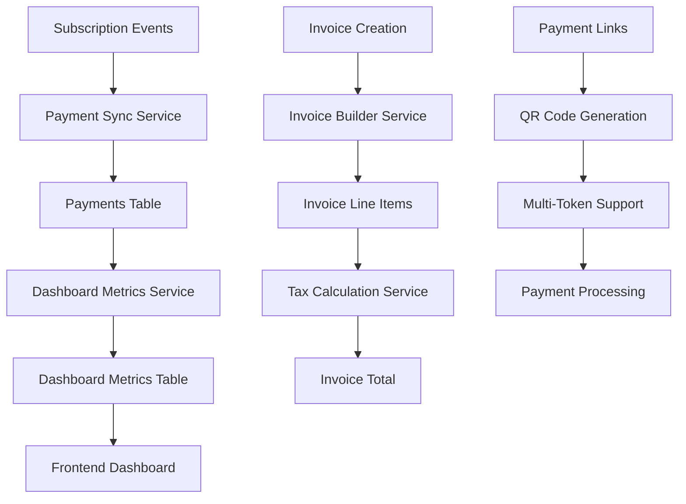
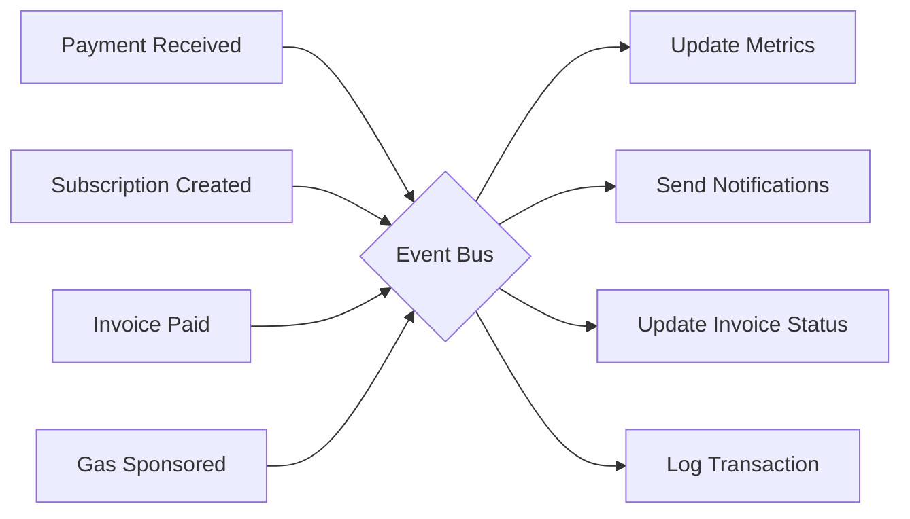
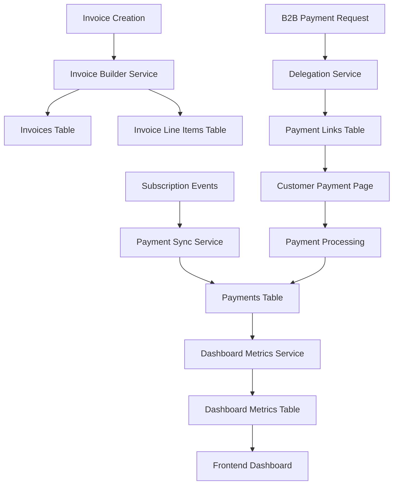

# Cyphera Platform Enhancement Implementation Plan

## Executive Summary

This document outlines a comprehensive plan to transform Cyphera from a basic subscription platform into a robust, feature-rich crypto payments and invoicing system. The enhancements focus on real-time analytics, comprehensive invoice management, B2B payment flows, and competitive features that will position Cyphera as a leader in the crypto subscription space.

## Table of Contents

1. [Current State Analysis](#current-state-analysis)
2. [Enhanced Database Architecture](#enhanced-database-architecture)
3. [Backend API Development](#backend-api-development)
4. [Frontend Implementation](#frontend-implementation)
5. [Integration Strategy](#integration-strategy)
6. [Phased Implementation Approach](#phased-implementation-approach)
7. [Competitive Features](#competitive-features)
8. [Technical Considerations](#technical-considerations)

## Current State Analysis

### Existing Infrastructure
- **Database**: PostgreSQL with products, prices, subscriptions, invoices tables
- **Payment Events**: Using subscription_events table instead of dedicated payments table
- **Invoice Structure**: JSONB line_items field (not normalized)
- **Frontend**: Static dashboard showing 0.00 for all metrics (no currency symbol)
- **Architecture**: Multi-tenant with workspaces, good foundation

### Key Gaps
- No real-time revenue metrics (MRR, ARR, churn)
- Limited invoice functionality (no line item management)
- No B2B payment flows with delegation
- Missing competitive features (dunning, analytics, payment links)
- No payment reconciliation system

## Enhanced Database Architecture

### New Tables

#### 1. payments
```sql
CREATE TABLE payments (
    id UUID PRIMARY KEY DEFAULT uuid_generate_v4(),
    workspace_id UUID NOT NULL REFERENCES workspaces(id),
    invoice_id UUID REFERENCES invoices(id),
    subscription_id UUID REFERENCES subscriptions(id),
    subscription_event UUID REFERENCES subscription_events(id),
    customer_id UUID NOT NULL REFERENCES customers(id),
    
    -- Payment details
    amount_in_cents BIGINT NOT NULL,
    currency VARCHAR(3) NOT NULL REFERENCES fiat_currencies(code),
    status VARCHAR(50) NOT NULL, -- pending, processing, completed, failed, refunded
    payment_method VARCHAR(50) NOT NULL, -- crypto, card, bank_transfer
    
    -- Crypto specific
    transaction_hash VARCHAR(255),
    network_id UUID REFERENCES networks(id),
    token_id UUID REFERENCES tokens(id),
    
    -- Gas fee tracking
    gas_fee_in_cents BIGINT,
    gas_fee_wei TEXT, -- Store exact gas in wei for precision
    gas_fee_token_id UUID REFERENCES tokens(id), -- Which token paid for gas
    gas_fee_token_amount TEXT, -- Exact token amount for gas
    gas_sponsor_type VARCHAR(50), -- 'customer', 'merchant', 'platform'
    gas_sponsor_id UUID, -- Who sponsored (customer_id, workspace_id, etc)
    gas_price_gwei TEXT, -- Gas price at time of transaction
    gas_units_used BIGINT, -- Actual gas units consumed
    max_gas_units BIGINT, -- Max gas units set for transaction
    
    -- External references
    external_payment_id VARCHAR(255),
    payment_provider VARCHAR(50), -- circle, stripe, internal
    
    -- Tax breakdown
    subtotal_cents BIGINT,
    tax_amount_cents BIGINT,
    tax_included_in_amount BOOLEAN DEFAULT TRUE,
    
    -- Timestamps
    initiated_at TIMESTAMP NOT NULL DEFAULT CURRENT_TIMESTAMP,
    completed_at TIMESTAMP,
    failed_at TIMESTAMP,
    
    -- Metadata
    error_message TEXT,
    metadata JSONB DEFAULT '{}',
    
    created_at TIMESTAMP NOT NULL DEFAULT CURRENT_TIMESTAMP,
    updated_at TIMESTAMP NOT NULL DEFAULT CURRENT_TIMESTAMP,
    
    CONSTRAINT unique_transaction_hash UNIQUE(transaction_hash),
    CONSTRAINT unique_external_payment UNIQUE(workspace_id, external_payment_id, payment_provider)
);

-- Indexes for performance
CREATE INDEX idx_payments_workspace_status ON payments(workspace_id, status);
CREATE INDEX idx_payments_customer ON payments(customer_id);
CREATE INDEX idx_payments_completed_at ON payments(workspace_id, completed_at);
CREATE INDEX idx_payments_transaction_hash ON payments(transaction_hash) WHERE transaction_hash IS NOT NULL;
```

#### 2. invoice_line_items
```sql
CREATE TABLE invoice_line_items (
    id UUID PRIMARY KEY DEFAULT uuid_generate_v4(),
    invoice_id UUID NOT NULL REFERENCES invoices(id) ON DELETE CASCADE,
    
    -- Line item details
    description TEXT NOT NULL,
    quantity DECIMAL(10,4) NOT NULL DEFAULT 1,
    unit_amount_in_cents BIGINT NOT NULL,
    amount_in_cents BIGINT NOT NULL, -- quantity * unit_amount
    
    -- Currency details
    fiat_currency VARCHAR(3) NOT NULL REFERENCES fiat_currencies(code), -- ISO 4217 currency code
    
    -- References
    subscription_id UUID REFERENCES subscriptions(id),
    product_id UUID REFERENCES products(id),
    price_id UUID REFERENCES prices(id),
    
    -- Crypto payment details
    network_id UUID REFERENCES networks(id),
    token_id UUID REFERENCES tokens(id),
    crypto_amount DECIMAL(36,18), -- Actual token amount (supports up to 18 decimals)
    exchange_rate DECIMAL(20,8), -- Fiat to crypto rate at time of invoice
    
    -- Tax
    tax_rate DECIMAL(5,4) DEFAULT 0, -- 0.0000 to 0.9999 (0% to 99.99%)
    tax_amount_in_cents BIGINT DEFAULT 0,
    tax_crypto_amount DECIMAL(36,18), -- Tax amount in crypto
    
    -- Period for subscription items
    period_start TIMESTAMP,
    period_end TIMESTAMP,
    
    -- Gas fee tracking
    line_item_type VARCHAR(50) DEFAULT 'product', -- 'product', 'gas_fee', 'tax', 'discount'
    gas_fee_payment_id UUID REFERENCES gas_fee_payments(id),
    is_gas_sponsored BOOLEAN DEFAULT FALSE,
    gas_sponsor_type VARCHAR(50),
    gas_sponsor_name VARCHAR(255), -- Human readable sponsor name
    
    -- Metadata
    metadata JSONB DEFAULT '{}',
    
    created_at TIMESTAMP NOT NULL DEFAULT CURRENT_TIMESTAMP,
    updated_at TIMESTAMP NOT NULL DEFAULT CURRENT_TIMESTAMP
);

-- Add constraint to ensure gas line items have proper references
ALTER TABLE invoice_line_items 
ADD CONSTRAINT chk_gas_line_item 
CHECK (
    (line_item_type != 'gas_fee') OR 
    (line_item_type = 'gas_fee' AND gas_fee_payment_id IS NOT NULL)
);

CREATE INDEX idx_line_items_invoice ON invoice_line_items(invoice_id);
CREATE INDEX idx_line_items_token ON invoice_line_items(token_id) WHERE token_id IS NOT NULL;
CREATE INDEX idx_line_items_currency ON invoice_line_items(fiat_currency, invoice_id);
CREATE INDEX idx_line_items_type ON invoice_line_items(line_item_type) WHERE line_item_type != 'product';
```

#### 3. dashboard_metrics
```sql
CREATE TABLE dashboard_metrics (
    id UUID PRIMARY KEY DEFAULT uuid_generate_v4(),
    workspace_id UUID NOT NULL REFERENCES workspaces(id),
    
    -- Time period
    metric_date DATE NOT NULL,
    metric_type VARCHAR(50) NOT NULL, -- hourly, daily, weekly, monthly, yearly
    metric_hour INTEGER, -- 0-23 for hourly metrics
    
    -- Currency
    fiat_currency VARCHAR(3) NOT NULL REFERENCES fiat_currencies(code),
    
    -- Revenue metrics (stored in cents)
    mrr_cents BIGINT DEFAULT 0,
    arr_cents BIGINT DEFAULT 0,
    total_revenue_cents BIGINT DEFAULT 0,
    new_revenue_cents BIGINT DEFAULT 0,
    expansion_revenue_cents BIGINT DEFAULT 0, -- Upsells/upgrades
    contraction_revenue_cents BIGINT DEFAULT 0, -- Downgrades
    
    -- Customer metrics
    total_customers INTEGER DEFAULT 0,
    new_customers INTEGER DEFAULT 0,
    churned_customers INTEGER DEFAULT 0,
    reactivated_customers INTEGER DEFAULT 0,
    
    -- Subscription metrics
    active_subscriptions INTEGER DEFAULT 0,
    new_subscriptions INTEGER DEFAULT 0,
    cancelled_subscriptions INTEGER DEFAULT 0,
    paused_subscriptions INTEGER DEFAULT 0,
    trial_subscriptions INTEGER DEFAULT 0,
    
    -- Calculated rates
    churn_rate DECIMAL(5,4) DEFAULT 0, -- 0.0000 to 0.9999
    growth_rate DECIMAL(5,4) DEFAULT 0,
    ltv_avg_cents BIGINT DEFAULT 0, -- Average customer lifetime value
    
    -- Payment metrics
    successful_payments INTEGER DEFAULT 0,
    failed_payments INTEGER DEFAULT 0,
    pending_payments INTEGER DEFAULT 0,
    total_payment_volume_cents BIGINT DEFAULT 0,
    avg_payment_size_cents BIGINT DEFAULT 0,
    
    -- Crypto-specific metrics
    total_gas_fees_cents BIGINT DEFAULT 0,
    sponsored_gas_fees_cents BIGINT DEFAULT 0, -- Gas fees paid by merchant
    customer_gas_fees_cents BIGINT DEFAULT 0, -- Gas fees paid by customer
    avg_gas_fee_cents BIGINT DEFAULT 0,
    gas_sponsorship_rate DECIMAL(5,2), -- Percentage of gas sponsored
    unique_wallet_addresses INTEGER DEFAULT 0,
    new_wallet_addresses INTEGER DEFAULT 0,
    
    -- Network breakdown (JSONB for flexibility)
    network_metrics JSONB DEFAULT '{}', -- {ethereum: {payments: 10, volume_cents: 1000}, polygon: {...}}
    token_metrics JSONB DEFAULT '{}', -- {USDC: {payments: 10, volume_cents: 1000}, USDT: {...}}
    
    -- Performance metrics
    avg_payment_confirmation_time_seconds INTEGER,
    payment_success_rate DECIMAL(5,4) DEFAULT 0, -- 0.0000 to 1.0000
    
    created_at TIMESTAMP NOT NULL DEFAULT CURRENT_TIMESTAMP,
    updated_at TIMESTAMP NOT NULL DEFAULT CURRENT_TIMESTAMP,
    
    CONSTRAINT unique_workspace_metric UNIQUE(workspace_id, metric_date, metric_type, metric_hour, fiat_currency)
);

CREATE INDEX idx_metrics_workspace_date ON dashboard_metrics(workspace_id, metric_date DESC, metric_type);
CREATE INDEX idx_metrics_hourly ON dashboard_metrics(workspace_id, metric_date, metric_hour) WHERE metric_type = 'hourly';
CREATE INDEX idx_metrics_currency ON dashboard_metrics(workspace_id, fiat_currency, metric_date DESC);

-- Materialized view for real-time dashboard (refreshed every 5 minutes)
CREATE MATERIALIZED VIEW dashboard_current_metrics AS
SELECT 
    w.id as workspace_id,
    w.name as workspace_name,
    -- Current period metrics
    COALESCE(dm.mrr_cents, 0) as current_mrr_cents,
    COALESCE(dm.total_customers, 0) as current_customers,
    COALESCE(dm.active_subscriptions, 0) as active_subscriptions,
    -- Today's metrics
    COALESCE(dt.successful_payments, 0) as todays_payments,
    COALESCE(dt.total_payment_volume_cents, 0) as todays_volume_cents,
    COALESCE(dt.failed_payments, 0) as todays_failed_payments,
    -- Real-time calculations
    CASE 
        WHEN dt.successful_payments + dt.failed_payments > 0 
        THEN dt.successful_payments::DECIMAL / (dt.successful_payments + dt.failed_payments)
        ELSE 0 
    END as todays_success_rate
FROM workspaces w
LEFT JOIN dashboard_metrics dm ON dm.workspace_id = w.id 
    AND dm.metric_date = DATE_TRUNC('month', CURRENT_DATE)
    AND dm.metric_type = 'monthly'
LEFT JOIN dashboard_metrics dt ON dt.workspace_id = w.id 
    AND dt.metric_date = CURRENT_DATE
    AND dt.metric_type = 'daily'
WHERE w.deleted_at IS NULL;

CREATE UNIQUE INDEX idx_dashboard_current_workspace ON dashboard_current_metrics(workspace_id);

-- Time-series hypertable for high-frequency metrics (requires TimescaleDB extension)
-- CREATE EXTENSION IF NOT EXISTS timescaledb;
-- SELECT create_hypertable('dashboard_metrics', 'metric_date', 
--     chunk_time_interval => INTERVAL '1 month',
--     if_not_exists => TRUE
-- );
```

#### 4. payment_links
```sql
-- Note: This table replaces the need for one_off enum on subscriptions table
-- Payment links provide flexible support for both one-time and recurring payments
CREATE TABLE payment_links (
    id UUID PRIMARY KEY DEFAULT uuid_generate_v4(),
    workspace_id UUID NOT NULL REFERENCES workspaces(id),
    
    -- Link details
    slug VARCHAR(255) NOT NULL UNIQUE,
    status VARCHAR(50) NOT NULL DEFAULT 'active', -- active, inactive, expired
    
    -- Payment configuration
    product_id UUID REFERENCES products(id),
    price_id UUID REFERENCES prices(id),
    amount_in_cents BIGINT, -- For one-time custom amounts
    currency VARCHAR(3) REFERENCES fiat_currencies(code),
    payment_type VARCHAR(50) DEFAULT 'one_time', -- one_time, recurring
    
    -- Customer collection
    collect_email BOOLEAN DEFAULT true,
    collect_shipping BOOLEAN DEFAULT false,
    collect_name BOOLEAN DEFAULT true,
    
    -- Expiration
    expires_at TIMESTAMP,
    max_uses INTEGER,
    used_count INTEGER DEFAULT 0,
    
    -- Success behavior
    redirect_url TEXT, -- Where to redirect after successful payment
    
    -- QR Code
    qr_code_url TEXT,
    
    -- Metadata
    metadata JSONB DEFAULT '{}',
    
    created_at TIMESTAMP NOT NULL DEFAULT CURRENT_TIMESTAMP,
    updated_at TIMESTAMP NOT NULL DEFAULT CURRENT_TIMESTAMP,
    deleted_at TIMESTAMP
);

CREATE INDEX idx_payment_links_slug ON payment_links(slug) WHERE deleted_at IS NULL;
CREATE INDEX idx_payment_links_workspace ON payment_links(workspace_id) WHERE deleted_at IS NULL;
CREATE INDEX idx_payment_links_status ON payment_links(status, expires_at) WHERE deleted_at IS NULL;
```

#### 5. dunning_schedules
```sql
CREATE TABLE dunning_schedules (
    id UUID PRIMARY KEY DEFAULT uuid_generate_v4(),
    workspace_id UUID NOT NULL REFERENCES workspaces(id),
    
    name VARCHAR(255) NOT NULL,
    description TEXT,
    
    -- Schedule configuration
    attempts JSONB NOT NULL DEFAULT '[]', -- Array of {day: 1, action: "email", template: "..."}
    
    -- Settings
    is_active BOOLEAN DEFAULT true,
    stop_on_success BOOLEAN DEFAULT true,
    final_action VARCHAR(50), -- cancel, pause, downgrade
    
    created_at TIMESTAMP NOT NULL DEFAULT CURRENT_TIMESTAMP,
    updated_at TIMESTAMP NOT NULL DEFAULT CURRENT_TIMESTAMP,
    deleted_at TIMESTAMP
);
```

#### 6. fiat_currencies
```sql
CREATE TABLE fiat_currencies (
    id UUID PRIMARY KEY DEFAULT uuid_generate_v4(),
    code VARCHAR(3) NOT NULL UNIQUE, -- ISO 4217 currency code (USD, EUR, GBP, etc.)
    name VARCHAR(100) NOT NULL, -- Full currency name
    symbol VARCHAR(10) NOT NULL, -- Currency symbol ($, €, £, etc.)
    decimal_places INTEGER NOT NULL DEFAULT 2, -- Number of decimal places
    is_active BOOLEAN DEFAULT true,
    
    -- Display settings
    symbol_position VARCHAR(10) DEFAULT 'before', -- before or after the amount
    thousand_separator VARCHAR(2) DEFAULT ',',
    decimal_separator VARCHAR(2) DEFAULT '.',
    
    -- Regional info
    countries JSONB DEFAULT '[]', -- Array of country codes using this currency
    
    created_at TIMESTAMP NOT NULL DEFAULT CURRENT_TIMESTAMP,
    updated_at TIMESTAMP NOT NULL DEFAULT CURRENT_TIMESTAMP
);

-- Insert common currencies
INSERT INTO fiat_currencies (code, name, symbol, decimal_places, countries) VALUES
    ('USD', 'US Dollar', '$', 2, '["US"]'),
    ('EUR', 'Euro', '€', 2, '["DE", "FR", "IT", "ES", "NL", "BE", "AT", "IE", "FI", "PT", "GR", "LU"]'),
    ('GBP', 'British Pound', '£', 2, '["GB"]'),
    ('JPY', 'Japanese Yen', '¥', 0, '["JP"]'),
    ('CAD', 'Canadian Dollar', 'C$', 2, '["CA"]'),
    ('AUD', 'Australian Dollar', 'A$', 2, '["AU"]'),
    ('CHF', 'Swiss Franc', 'Fr', 2, '["CH"]'),
    ('CNY', 'Chinese Yuan', '¥', 2, '["CN"]'),
    ('INR', 'Indian Rupee', '₹', 2, '["IN"]'),
    ('SGD', 'Singapore Dollar', 'S$', 2, '["SG"]');

CREATE INDEX idx_fiat_currencies_active ON fiat_currencies(is_active, code);
```

#### 7. discount_codes
```sql
CREATE TABLE discount_codes (
    id UUID PRIMARY KEY DEFAULT uuid_generate_v4(),
    workspace_id UUID NOT NULL REFERENCES workspaces(id),
    
    -- Code details
    code VARCHAR(50) NOT NULL,
    name VARCHAR(255) NOT NULL,
    description TEXT,
    
    -- Discount configuration
    discount_type VARCHAR(50) NOT NULL, -- 'percentage', 'fixed_amount', 'fixed_price'
    discount_value DECIMAL(10,2) NOT NULL, -- Percentage (0-100) or amount in cents
    currency VARCHAR(3) REFERENCES fiat_currencies(code), -- For fixed_amount type
    
    -- Applicability
    applies_to VARCHAR(50) NOT NULL DEFAULT 'all', -- 'all', 'specific_products', 'specific_prices'
    product_ids UUID[] DEFAULT '{}', -- Specific products this applies to
    price_ids UUID[] DEFAULT '{}', -- Specific prices this applies to
    
    -- Usage limits
    max_uses INTEGER, -- NULL for unlimited
    max_uses_per_customer INTEGER DEFAULT 1,
    used_count INTEGER DEFAULT 0,
    
    -- Duration
    valid_from TIMESTAMP NOT NULL DEFAULT CURRENT_TIMESTAMP,
    valid_until TIMESTAMP,
    
    -- Conditions
    minimum_amount_cents BIGINT, -- Minimum order amount
    first_time_only BOOLEAN DEFAULT false, -- Only for new customers
    
    -- Trial configuration (for subscription discounts)
    grants_trial_days INTEGER, -- Number of trial days to add
    
    -- Status
    is_active BOOLEAN DEFAULT true,
    
    -- Metadata
    metadata JSONB DEFAULT '{}',
    
    created_at TIMESTAMP NOT NULL DEFAULT CURRENT_TIMESTAMP,
    updated_at TIMESTAMP NOT NULL DEFAULT CURRENT_TIMESTAMP,
    deleted_at TIMESTAMP,
    
    CONSTRAINT unique_discount_code UNIQUE(workspace_id, code)
);

CREATE INDEX idx_discount_codes_workspace ON discount_codes(workspace_id, is_active);
CREATE INDEX idx_discount_codes_code ON discount_codes(code) WHERE deleted_at IS NULL;
CREATE INDEX idx_discount_codes_valid ON discount_codes(valid_from, valid_until) WHERE is_active = true;
```

#### 8. discount_usage
```sql
CREATE TABLE discount_usage (
    id UUID PRIMARY KEY DEFAULT uuid_generate_v4(),
    discount_code_id UUID NOT NULL REFERENCES discount_codes(id),
    
    -- Who used it
    customer_id UUID NOT NULL REFERENCES customers(id),
    
    -- Where it was applied
    applied_to_type VARCHAR(50) NOT NULL, -- 'subscription', 'invoice', 'payment_link'
    applied_to_id UUID NOT NULL, -- ID of the entity it was applied to
    
    -- Discount details at time of use
    discount_amount_cents BIGINT NOT NULL,
    currency VARCHAR(3) NOT NULL,
    
    -- Usage tracking
    used_at TIMESTAMP NOT NULL DEFAULT CURRENT_TIMESTAMP,
    
    created_at TIMESTAMP NOT NULL DEFAULT CURRENT_TIMESTAMP
);

CREATE INDEX idx_discount_usage_code ON discount_usage(discount_code_id);
CREATE INDEX idx_discount_usage_customer ON discount_usage(customer_id);
CREATE INDEX idx_discount_usage_applied ON discount_usage(applied_to_type, applied_to_id);
```

#### 9. subscription_discounts
```sql
-- Tracks discounts applied to subscription line items
CREATE TABLE subscription_discounts (
    id UUID PRIMARY KEY DEFAULT uuid_generate_v4(),
    subscription_line_item_id UUID NOT NULL REFERENCES subscription_line_items(id) ON DELETE CASCADE,
    discount_code_id UUID REFERENCES discount_codes(id),
    
    -- Discount details
    discount_type VARCHAR(50) NOT NULL, -- 'percentage', 'fixed_amount', 'trial'
    discount_value DECIMAL(10,2) NOT NULL,
    discount_amount_cents BIGINT NOT NULL, -- Calculated discount amount
    
    -- Duration
    start_date TIMESTAMP NOT NULL,
    end_date TIMESTAMP, -- NULL for permanent discounts
    
    -- For trials
    is_trial BOOLEAN DEFAULT false,
    trial_end_date TIMESTAMP,
    
    -- Status
    is_active BOOLEAN DEFAULT true,
    
    created_at TIMESTAMP NOT NULL DEFAULT CURRENT_TIMESTAMP,
    updated_at TIMESTAMP NOT NULL DEFAULT CURRENT_TIMESTAMP
);

CREATE INDEX idx_subscription_discounts_line_item ON subscription_discounts(subscription_line_item_id);
CREATE INDEX idx_subscription_discounts_active ON subscription_discounts(is_active, end_date);
```

#### 10. gas_fee_payments

```sql
CREATE TABLE gas_fee_payments (
    id UUID PRIMARY KEY DEFAULT uuid_generate_v4(),
    payment_id UUID NOT NULL REFERENCES payments(id),
    
    -- Gas details
    gas_fee_wei TEXT NOT NULL, -- Exact gas fee in wei
    gas_price_gwei TEXT NOT NULL, -- Gas price at execution
    gas_units_used BIGINT NOT NULL, -- Actual gas consumed
    max_gas_units BIGINT NOT NULL, -- Gas limit set
    base_fee_gwei TEXT, -- EIP-1559 base fee
    priority_fee_gwei TEXT, -- EIP-1559 priority fee
    
    -- Payment details
    payment_token_id UUID REFERENCES tokens(id), -- Token used to pay gas
    payment_token_amount TEXT, -- Amount of token used
    payment_method VARCHAR(50) NOT NULL, -- 'native', 'relay', 'meta_transaction'
    
    -- Sponsorship
    sponsor_type VARCHAR(50) NOT NULL, -- 'customer', 'merchant', 'platform', 'third_party'
    sponsor_id UUID, -- References appropriate entity
    sponsor_workspace_id UUID REFERENCES workspaces(id),
    
    -- Network specifics
    network_id UUID NOT NULL REFERENCES networks(id),
    block_number BIGINT,
    block_timestamp TIMESTAMP,
    
    -- Conversion rates at time of payment
    eth_usd_price DECIMAL(10, 2), -- ETH price in USD
    token_usd_price DECIMAL(10, 2), -- Gas token price in USD
    gas_fee_usd_cents BIGINT, -- Calculated USD value
    
    created_at TIMESTAMP NOT NULL DEFAULT CURRENT_TIMESTAMP,
    
    CONSTRAINT fk_payment_gas FOREIGN KEY (payment_id) 
        REFERENCES payments(id) ON DELETE CASCADE
);

CREATE INDEX idx_gas_fee_payments_sponsor ON gas_fee_payments(sponsor_type, sponsor_id);
CREATE INDEX idx_gas_fee_payments_created ON gas_fee_payments(created_at);
```

#### 11. gas_sponsorship_configs

```sql
CREATE TABLE gas_sponsorship_configs (
    id UUID PRIMARY KEY DEFAULT uuid_generate_v4(),
    workspace_id UUID NOT NULL REFERENCES workspaces(id),
    
    -- Sponsorship settings
    sponsorship_enabled BOOLEAN DEFAULT FALSE,
    sponsor_customer_gas BOOLEAN DEFAULT FALSE, -- Merchant sponsors customer gas
    sponsor_threshold_usd_cents BIGINT, -- Max sponsorship per transaction
    monthly_budget_usd_cents BIGINT, -- Monthly sponsorship budget
    
    -- Rules
    sponsor_for_products JSONB DEFAULT '[]'::jsonb, -- Array of product IDs
    sponsor_for_customers JSONB DEFAULT '[]'::jsonb, -- Array of customer IDs
    sponsor_for_tiers JSONB DEFAULT '[]'::jsonb, -- Customer tiers eligible
    
    -- Tracking
    current_month_spent_cents BIGINT DEFAULT 0,
    last_reset_date DATE,
    
    created_at TIMESTAMP NOT NULL DEFAULT CURRENT_TIMESTAMP,
    updated_at TIMESTAMP NOT NULL DEFAULT CURRENT_TIMESTAMP,
    
    UNIQUE(workspace_id)
);
```

#### 12. tax_jurisdictions

```sql
CREATE TABLE tax_jurisdictions (
    id UUID PRIMARY KEY DEFAULT uuid_generate_v4(),
    
    -- Jurisdiction details
    country_code VARCHAR(2) NOT NULL, -- ISO 3166-1 alpha-2
    state_code VARCHAR(10), -- State/province code
    city VARCHAR(255),
    
    -- Jurisdiction info
    name VARCHAR(255) NOT NULL,
    jurisdiction_type VARCHAR(50) NOT NULL, -- 'country', 'state', 'city', 'special'
    parent_jurisdiction_id UUID REFERENCES tax_jurisdictions(id),
    
    -- Settings
    is_active BOOLEAN DEFAULT TRUE,
    requires_tax_id BOOLEAN DEFAULT FALSE,
    
    created_at TIMESTAMP NOT NULL DEFAULT CURRENT_TIMESTAMP,
    updated_at TIMESTAMP NOT NULL DEFAULT CURRENT_TIMESTAMP,
    
    UNIQUE(country_code, state_code, city)
);

CREATE INDEX idx_tax_jurisdictions_country ON tax_jurisdictions(country_code);
CREATE INDEX idx_tax_jurisdictions_active ON tax_jurisdictions(is_active);
```

#### 13. tax_rates

```sql
CREATE TABLE tax_rates (
    id UUID PRIMARY KEY DEFAULT uuid_generate_v4(),
    workspace_id UUID REFERENCES workspaces(id), -- NULL for platform-wide rates
    jurisdiction_id UUID NOT NULL REFERENCES tax_jurisdictions(id),
    
    -- Rate details
    tax_type VARCHAR(50) NOT NULL, -- 'sales_tax', 'vat', 'gst', 'digital_services_tax'
    rate_percent DECIMAL(5,4) NOT NULL, -- 0.0000 to 99.9999%
    
    -- Applicability
    applies_to_subscriptions BOOLEAN DEFAULT TRUE,
    applies_to_crypto BOOLEAN DEFAULT TRUE,
    
    -- B2B settings
    b2b_reverse_charge BOOLEAN DEFAULT FALSE,
    b2b_exempt BOOLEAN DEFAULT FALSE,
    
    -- Date range for rate validity
    effective_from DATE NOT NULL,
    effective_to DATE,
    
    created_at TIMESTAMP NOT NULL DEFAULT CURRENT_TIMESTAMP,
    updated_at TIMESTAMP NOT NULL DEFAULT CURRENT_TIMESTAMP,
    
    CONSTRAINT chk_rate_validity CHECK (effective_to IS NULL OR effective_to > effective_from)
);

CREATE INDEX idx_tax_rates_jurisdiction ON tax_rates(jurisdiction_id);
CREATE INDEX idx_tax_rates_effective ON tax_rates(effective_from, effective_to);
```

#### 14. tax_calculations

```sql
CREATE TABLE tax_calculations (
    id UUID PRIMARY KEY DEFAULT uuid_generate_v4(),
    
    -- References
    invoice_id UUID REFERENCES invoices(id),
    invoice_line_item_id UUID REFERENCES invoice_line_items(id),
    payment_id UUID REFERENCES payments(id),
    
    -- Customer info at time of calculation
    customer_id UUID NOT NULL REFERENCES customers(id),
    customer_jurisdiction_id UUID REFERENCES tax_jurisdictions(id),
    is_b2b BOOLEAN DEFAULT FALSE,
    
    -- Amounts
    subtotal_cents BIGINT NOT NULL,
    taxable_amount_cents BIGINT NOT NULL,
    
    -- Tax details
    tax_jurisdiction_id UUID NOT NULL REFERENCES tax_jurisdictions(id),
    tax_rate_id UUID NOT NULL REFERENCES tax_rates(id),
    tax_type VARCHAR(50) NOT NULL,
    tax_rate DECIMAL(5,4) NOT NULL,
    tax_amount_cents BIGINT NOT NULL,
    
    -- Calculation metadata
    calculation_method VARCHAR(50) NOT NULL, -- 'inclusive', 'exclusive'
    calculation_timestamp TIMESTAMP NOT NULL DEFAULT CURRENT_TIMESTAMP,
    
    created_at TIMESTAMP NOT NULL DEFAULT CURRENT_TIMESTAMP
);

CREATE INDEX idx_tax_calculations_invoice ON tax_calculations(invoice_id);
CREATE INDEX idx_tax_calculations_customer ON tax_calculations(customer_id);
```

#### 15. analytics_events (for real-time event streaming)
```sql
CREATE TABLE analytics_events (
    id UUID PRIMARY KEY DEFAULT uuid_generate_v4(),
    workspace_id UUID NOT NULL REFERENCES workspaces(id),
    
    -- Event identification
    event_type VARCHAR(100) NOT NULL, -- payment.completed, subscription.created, etc.
    event_timestamp TIMESTAMP NOT NULL DEFAULT CURRENT_TIMESTAMP,
    
    -- Entity references
    entity_type VARCHAR(50) NOT NULL, -- payment, subscription, customer, invoice
    entity_id UUID NOT NULL,
    
    -- Event data
    properties JSONB NOT NULL DEFAULT '{}', -- Flexible event properties
    
    -- Processing status
    processed BOOLEAN DEFAULT false,
    processed_at TIMESTAMP,
    
    created_at TIMESTAMP NOT NULL DEFAULT CURRENT_TIMESTAMP
);

-- Partition by month for better performance
CREATE INDEX idx_analytics_events_workspace_time ON analytics_events(workspace_id, event_timestamp DESC);
CREATE INDEX idx_analytics_events_unprocessed ON analytics_events(processed, event_timestamp) WHERE processed = false;
CREATE INDEX idx_analytics_events_type ON analytics_events(event_type, event_timestamp DESC);

-- Example event types for crypto payments:
-- payment.initiated, payment.completed, payment.failed
-- subscription.created, subscription.activated, subscription.cancelled
-- wallet.connected, wallet.delegated
```

### Database Views for Analytics

#### Gas Fee Analytics View
```sql
CREATE VIEW gas_fee_analytics AS
SELECT 
    p.workspace_id,
    DATE_TRUNC('day', gfp.created_at) as date,
    COUNT(*) as transaction_count,
    SUM(gfp.gas_fee_usd_cents) as total_gas_cents,
    SUM(CASE WHEN gfp.sponsor_type = 'merchant' THEN gfp.gas_fee_usd_cents ELSE 0 END) as sponsored_cents,
    SUM(CASE WHEN gfp.sponsor_type = 'customer' THEN gfp.gas_fee_usd_cents ELSE 0 END) as customer_paid_cents,
    AVG(gfp.gas_fee_usd_cents) as avg_gas_cents,
    AVG(gfp.gas_units_used) as avg_gas_units,
    COUNT(DISTINCT gfp.network_id) as networks_used,
    
    -- Sponsorship metrics
    COUNT(CASE WHEN gfp.sponsor_type = 'merchant' THEN 1 END)::FLOAT / 
        NULLIF(COUNT(*), 0) * 100 as sponsorship_rate,
    
    -- Network breakdown
    jsonb_object_agg(
        n.name, 
        jsonb_build_object(
            'count', COUNT(*) FILTER (WHERE gfp.network_id = n.id),
            'total_gas_cents', COALESCE(SUM(gfp.gas_fee_usd_cents) FILTER (WHERE gfp.network_id = n.id), 0),
            'avg_gas_cents', COALESCE(AVG(gfp.gas_fee_usd_cents) FILTER (WHERE gfp.network_id = n.id), 0)
        )
    ) as network_breakdown
FROM gas_fee_payments gfp
JOIN payments p ON p.id = gfp.payment_id
JOIN networks n ON n.id = gfp.network_id
WHERE p.status = 'completed'
GROUP BY p.workspace_id, DATE_TRUNC('day', gfp.created_at);

-- Index for performance
CREATE INDEX idx_gas_analytics_workspace_date ON gas_fee_payments(created_at, sponsor_type);
```

#### Invoice Summary View with Gas
```sql
CREATE VIEW invoice_summary_with_gas AS
SELECT 
    i.id,
    i.workspace_id,
    i.customer_id,
    i.status,
    i.amount_due_cents,
    
    -- Product totals
    SUM(ili.amount_in_cents) FILTER (WHERE ili.line_item_type = 'product') as product_total_cents,
    
    -- Gas totals
    SUM(ili.amount_in_cents) FILTER (WHERE ili.line_item_type = 'gas_fee' AND NOT ili.is_gas_sponsored) as customer_gas_cents,
    SUM(ili.amount_in_cents) FILTER (WHERE ili.line_item_type = 'gas_fee' AND ili.is_gas_sponsored) as sponsored_gas_cents,
    
    -- Tax totals
    SUM(ili.tax_amount_in_cents) as tax_total_cents,
    
    -- Final amount
    i.amount_due_cents - COALESCE(SUM(ili.amount_in_cents) FILTER (WHERE ili.is_gas_sponsored), 0) as customer_owes_cents
    
FROM invoices i
LEFT JOIN invoice_line_items ili ON ili.invoice_id = i.id
GROUP BY i.id;
```

### Database Modifications

#### Remove one_off enum from subscriptions table
```sql
-- IMPORTANT: Remove the one_off enum from subscriptions table
-- Payment links now handle both one-time and recurring payments
-- This provides better flexibility and cleaner architecture

-- If the column exists, migrate data first:
-- 1. Create payment links for any one-off subscriptions
-- 2. Update references
-- 3. Then remove the column
ALTER TABLE subscriptions DROP COLUMN IF EXISTS one_off;

-- Note: The payment_links table with payment_type field provides
-- a more flexible solution for different payment scenarios
```

#### Update invoices table
```sql
-- Add new columns to existing invoices table
ALTER TABLE invoices 
ADD COLUMN invoice_number VARCHAR(255),
ADD COLUMN subtotal_cents BIGINT,
ADD COLUMN discount_cents BIGINT DEFAULT 0,
ADD COLUMN payment_link_id UUID REFERENCES payment_links(id),
ADD COLUMN delegation_address VARCHAR(255),
ADD COLUMN qr_code_data TEXT,
-- Tax fields
ADD COLUMN tax_amount_cents BIGINT NOT NULL DEFAULT 0,
ADD COLUMN tax_details JSONB DEFAULT '[]'::jsonb, -- Array of tax calculations
ADD COLUMN customer_tax_id VARCHAR(255),
ADD COLUMN customer_jurisdiction_id UUID REFERENCES tax_jurisdictions(id),
ADD COLUMN reverse_charge_applies BOOLEAN DEFAULT FALSE;

-- Add unique constraint for invoice numbers per workspace
ALTER TABLE invoices 
ADD CONSTRAINT unique_workspace_invoice_number 
UNIQUE(workspace_id, invoice_number);
```

#### Update customers table for tax support
```sql
-- Add tax fields to customers table
ALTER TABLE customers 
ADD COLUMN tax_jurisdiction_id UUID REFERENCES tax_jurisdictions(id),
ADD COLUMN tax_id VARCHAR(255), -- VAT number, EIN, etc.
ADD COLUMN tax_id_type VARCHAR(50), -- 'vat', 'ein', 'gst', etc.
ADD COLUMN tax_id_verified BOOLEAN DEFAULT FALSE,
ADD COLUMN tax_id_verified_at TIMESTAMP,
ADD COLUMN is_business BOOLEAN DEFAULT FALSE,
ADD COLUMN business_name VARCHAR(255),
ADD COLUMN billing_country VARCHAR(2), -- ISO country code
ADD COLUMN billing_state VARCHAR(50),
ADD COLUMN billing_city VARCHAR(255),
ADD COLUMN billing_postal_code VARCHAR(20);

-- Index for tax lookups
CREATE INDEX idx_customers_tax_jurisdiction ON customers(tax_jurisdiction_id);
CREATE INDEX idx_customers_billing_location ON customers(billing_country, billing_state);
```

#### Update workspaces table for default currency
```sql
-- Add default currency to workspaces
ALTER TABLE workspaces
ADD COLUMN default_currency VARCHAR(3) DEFAULT 'USD' REFERENCES fiat_currencies(code),
ADD COLUMN supported_currencies JSONB DEFAULT '["USD"]'::jsonb; -- Array of supported currency codes

-- Update existing workspaces to have USD as default
UPDATE workspaces SET default_currency = 'USD' WHERE default_currency IS NULL;
```

#### Sync subscription_events with payments
```sql
-- Migration to populate payments table from subscription_events
INSERT INTO payments (
    workspace_id,
    subscription_id,
    customer_id,
    amount_in_cents,
    currency,
    status,
    payment_method,
    transaction_hash,
    network_id,
    token_id,
    completed_at,
    metadata
)
SELECT 
    s.workspace_id,
    se.subscription_id,
    s.customer_id,
    se.amount_in_cents,
    COALESCE(w.default_currency, 'USD') as currency, -- Use workspace default currency
    CASE 
        WHEN se.event_type = 'redeemed' THEN 'completed'
        WHEN se.event_type = 'failed' THEN 'failed'
        ELSE 'pending'
    END as status,
    'crypto' as payment_method,
    se.transaction_hash,
    pt.network_id,
    pt.token_id,
    CASE 
        WHEN se.event_type = 'redeemed' THEN se.occurred_at
        ELSE NULL
    END as completed_at,
    se.metadata
FROM subscription_events se
JOIN subscriptions s ON se.subscription_id = s.id
JOIN products_tokens pt ON s.product_token_id = pt.id
JOIN workspaces w ON w.id = s.workspace_id
WHERE se.event_type IN ('redeemed', 'failed');
```

## Backend API Development

### 1. Analytics Endpoints

#### Dashboard Metrics API
```go
// GET /api/v1/analytics/dashboard
type DashboardResponse struct {
    Period      string              `json:"period"` // today, week, month, year
    Metrics     DashboardMetrics    `json:"metrics"`
    Charts      DashboardCharts     `json:"charts"`
    Comparisons PeriodComparisons   `json:"comparisons"`
}

type DashboardMetrics struct {
    MRR            MoneyAmount `json:"mrr"`
    ARR            MoneyAmount `json:"arr"`
    TotalRevenue   MoneyAmount `json:"total_revenue"`
    ActiveCustomers int        `json:"active_customers"`
    ChurnRate      float64     `json:"churn_rate"`
    GrowthRate     float64     `json:"growth_rate"`
}

// GET /api/v1/analytics/revenue
type RevenueAnalyticsResponse struct {
    TimeRange    TimeRange         `json:"time_range"`
    Breakdown    []RevenueBreakdown `json:"breakdown"`
    ByProduct    []ProductRevenue   `json:"by_product"`
    ByCustomer   []CustomerRevenue  `json:"by_customer"`
    Projections  RevenueProjections `json:"projections"`
}
```

#### Implementation Details
```go
// handlers/analytics_handler.go
func (h *AnalyticsHandler) GetDashboardMetrics(c *gin.Context) {
    workspaceID := c.GetString("workspace_id")
    period := c.DefaultQuery("period", "month")
    
    // Get current metrics
    currentMetrics, err := h.queries.GetDashboardMetrics(c, db.GetDashboardMetricsParams{
        WorkspaceID: workspaceID,
        StartDate:   getStartDate(period),
        EndDate:     time.Now(),
    })
    
    // Calculate MRR/ARR
    mrr := h.calculateMRR(c, workspaceID)
    arr := mrr * 12
    
    // Get comparison data
    previousMetrics := h.getPreviousPeriodMetrics(c, workspaceID, period)
    
    // Calculate growth and churn
    growth := calculateGrowthRate(currentMetrics, previousMetrics)
    churn := h.calculateChurnRate(c, workspaceID, period)
    
    c.JSON(200, DashboardResponse{
        Period: period,
        Metrics: DashboardMetrics{
            MRR:             MoneyAmount{Amount: mrr, Currency: workspace.DefaultCurrency},
            ARR:             MoneyAmount{Amount: arr, Currency: workspace.DefaultCurrency},
            TotalRevenue:    MoneyAmount{Amount: currentMetrics.TotalRevenue, Currency: workspace.DefaultCurrency},
            ActiveCustomers: currentMetrics.ActiveCustomers,
            ChurnRate:      churn,
            GrowthRate:     growth,
        },
        Charts: h.generateChartData(c, workspaceID, period),
        Comparisons: h.generateComparisons(currentMetrics, previousMetrics),
    })
}
```

### 2. Enhanced Invoice Management

#### Invoice API Enhancements
```go
// POST /api/v1/invoices
type CreateInvoiceRequest struct {
    CustomerID   string           `json:"customer_id" binding:"required"`
    DueDate      *time.Time       `json:"due_date"`
    LineItems    []LineItemInput  `json:"line_items" binding:"required,min=1"`
    TaxRate      *float64         `json:"tax_rate"`
    Notes        string           `json:"notes"`
    Metadata     map[string]any   `json:"metadata"`
}

type LineItemInput struct {
    Description  string  `json:"description" binding:"required"`
    Quantity     float64 `json:"quantity" binding:"required,min=0"`
    UnitAmount   int64   `json:"unit_amount" binding:"required,min=0"`
    ProductID    *string `json:"product_id"`
    PriceID      *string `json:"price_id"`
}

// GET /api/v1/invoices/:id/preview
// Returns rendered invoice preview

// POST /api/v1/invoices/:id/send
// Send invoice to customer via email

// POST /api/v1/invoices/:id/finalize
// Finalize draft invoice

// GET /api/v1/invoices/:id/payment-link
// Get payment link with QR code
```

#### Invoice Builder Service
```go
// services/invoice_builder.go
type InvoiceBuilder struct {
    db      *db.Queries
    logger  *zap.Logger
    pdf     PDFGenerator
    storage StorageService
}

func (b *InvoiceBuilder) CreateInvoice(ctx context.Context, req CreateInvoiceRequest) (*Invoice, error) {
    // Start transaction
    tx, err := b.db.BeginTx(ctx)
    if err != nil {
        return nil, err
    }
    defer tx.Rollback()
    
    // Generate invoice number
    invoiceNumber := b.generateInvoiceNumber(ctx, req.WorkspaceID)
    
    // Calculate totals
    subtotal := b.calculateSubtotal(req.LineItems)
    tax := b.calculateTax(subtotal, req.TaxRate)
    total := subtotal + tax
    
    // Create invoice
    invoice, err := tx.CreateInvoice(ctx, db.CreateInvoiceParams{
        WorkspaceID:    req.WorkspaceID,
        CustomerID:     req.CustomerID,
        InvoiceNumber:  invoiceNumber,
        Status:         "draft",
        SubtotalCents:  subtotal,
        TaxAmount:      tax,
        AmountDue:      total,
        Currency:       workspace.DefaultCurrency,
        DueDate:        req.DueDate,
        Metadata:       req.Metadata,
    })
    
    // Create line items
    for _, item := range req.LineItems {
        _, err = tx.CreateInvoiceLineItem(ctx, db.CreateInvoiceLineItemParams{
            InvoiceID:    invoice.ID,
            Description:  item.Description,
            Quantity:     item.Quantity,
            UnitAmount:   item.UnitAmount,
            Amount:       int64(item.Quantity * float64(item.UnitAmount)),
            ProductID:    item.ProductID,
            PriceID:      item.PriceID,
        })
        if err != nil {
            return nil, err
        }
    }
    
    // Commit transaction
    return invoice, tx.Commit()
}
```

### 3. B2B Payment Flow

#### Delegation-Based Invoice Payment
```go
// POST /api/v1/invoices/:id/request-payment
type RequestPaymentRequest struct {
    CustomerEmail    string `json:"customer_email" binding:"required,email"`
    DelegationAmount string `json:"delegation_amount" binding:"required"`
    ExpiresIn        int    `json:"expires_in_hours" binding:"min=1,max=720"` // Max 30 days
}

// handlers/b2b_payment_handler.go
func (h *B2BPaymentHandler) RequestInvoicePayment(c *gin.Context) {
    invoiceID := c.Param("id")
    var req RequestPaymentRequest
    
    if err := c.ShouldBindJSON(&req); err != nil {
        c.JSON(400, gin.H{"error": err.Error()})
        return
    }
    
    // Get invoice
    invoice, err := h.queries.GetInvoice(c, invoiceID)
    if err != nil {
        c.JSON(404, gin.H{"error": "Invoice not found"})
        return
    }
    
    // Create delegation request
    delegationReq, err := h.delegationClient.CreateDelegationRequest(c, &DelegationRequest{
        RecipientAddress: h.cypheraWalletAddress,
        Amount:          req.DelegationAmount,
        Token:           invoice.TokenAddress,
        ExpiresAt:       time.Now().Add(time.Hour * time.Duration(req.ExpiresIn)),
    })
    
    // Create payment link
    paymentLink, err := h.queries.CreatePaymentLink(c, db.CreatePaymentLinkParams{
        WorkspaceID:  invoice.WorkspaceID,
        InvoiceID:    invoice.ID,
        Slug:         generateSlug(),
        Amount:       invoice.AmountDue,
        Currency:     invoice.Currency,
        ExpiresAt:    delegationReq.ExpiresAt,
    })
    
    // Generate QR code
    qrCode := h.generatePaymentQR(paymentLink.Slug)
    
    // Send email notification
    h.emailService.SendInvoicePaymentRequest(req.CustomerEmail, EmailData{
        InvoiceNumber: invoice.Number,
        Amount:        formatMoney(invoice.AmountDue),
        PaymentLink:   fmt.Sprintf("%s/pay/%s", h.baseURL, paymentLink.Slug),
        QRCode:        qrCode,
        ExpiresAt:     delegationReq.ExpiresAt,
    })
    
    c.JSON(200, gin.H{
        "payment_link": paymentLink,
        "qr_code":      qrCode,
        "expires_at":   delegationReq.ExpiresAt,
    })
}
```

### 4. Payment Synchronization

#### Sync Service Enhancement
```go
// services/payment_sync_service.go
func (s *PaymentSyncService) SyncSubscriptionEvents(ctx context.Context, workspaceID string) error {
    // Get unsynced events
    events, err := s.queries.GetUnsyncedSubscriptionEvents(ctx, workspaceID)
    if err != nil {
        return err
    }
    
    for _, event := range events {
        // Create payment record
        payment, err := s.queries.CreatePayment(ctx, db.CreatePaymentParams{
            WorkspaceID:     workspaceID,
            SubscriptionID:  event.SubscriptionID,
            CustomerID:      event.CustomerID,
            AmountInCents:   event.AmountInCents,
            Status:          mapEventTypeToPaymentStatus(event.EventType),
            PaymentMethod:   "crypto",
            TransactionHash: event.TransactionHash,
            CompletedAt:     event.OccurredAt,
            Metadata:        event.Metadata,
        })
        
        if err != nil {
            s.logger.Error("Failed to create payment", zap.Error(err))
            continue
        }
        
        // Update metrics
        s.updateDashboardMetrics(ctx, workspaceID, payment)
        
        // Mark event as synced
        s.queries.MarkSubscriptionEventSynced(ctx, event.ID)
    }
    
    return nil
}
```

### 5. Currency Management Migration

#### Currency Service
```go
// services/currency_service.go
type CurrencyService struct {
    db     *db.Queries
    cache  *cache.Cache
    logger *zap.Logger
}

// Migrate from hardcoded constants to database-driven currencies
func (s *CurrencyService) GetCurrency(ctx context.Context, code string) (*Currency, error) {
    // Check cache first
    if cached, found := s.cache.Get(code); found {
        return cached.(*Currency), nil
    }
    
    // Fetch from database
    currency, err := s.db.GetFiatCurrency(ctx, code)
    if err != nil {
        return nil, fmt.Errorf("currency %s not found: %w", code, err)
    }
    
    // Cache for future use
    s.cache.Set(code, currency, cache.DefaultExpiration)
    
    return currency, nil
}

// Format amount with proper currency display
func (s *CurrencyService) FormatAmount(ctx context.Context, amountCents int64, currencyCode string) (string, error) {
    currency, err := s.GetCurrency(ctx, currencyCode)
    if err != nil {
        return "", err
    }
    
    // Convert cents to decimal amount
    divisor := math.Pow(10, float64(currency.DecimalPlaces))
    amount := float64(amountCents) / divisor
    
    // Format based on currency settings
    formatted := s.formatWithSeparators(amount, currency)
    
    // Add symbol in correct position
    if currency.SymbolPosition == "before" {
        return currency.Symbol + formatted, nil
    }
    return formatted + currency.Symbol, nil
}

// Migration from constants
func MigrateCurrencyConstants() {
    // Old approach (to be removed):
    // const (
    //     USD = "USD"
    //     EUR = "EUR"
    //     // etc...
    // )
    
    // New approach: Use database-driven currencies
    // All currency codes should be fetched from fiat_currencies table
}
```

#### Currency API Endpoints
```go
// GET /api/v1/currencies
// List all available fiat currencies
func (h *CurrencyHandler) ListCurrencies(c *gin.Context) {
    currencies, err := h.queries.ListActiveFiatCurrencies(c)
    if err != nil {
        c.JSON(500, gin.H{"error": "Failed to fetch currencies"})
        return
    }
    
    c.JSON(200, gin.H{"currencies": currencies})
}

// GET /api/v1/currencies/:code
// Get specific currency details
func (h *CurrencyHandler) GetCurrency(c *gin.Context) {
    code := c.Param("code")
    
    currency, err := h.currencyService.GetCurrency(c, code)
    if err != nil {
        c.JSON(404, gin.H{"error": "Currency not found"})
        return
    }
    
    c.JSON(200, currency)
}
```

## Note on Frontend Implementation

The frontend implementation details have been moved to a dedicated document: `frontend-implementation-plan.md`. This separation ensures clear boundaries between backend and frontend concerns while maintaining the comprehensive nature of the platform enhancement.

The frontend document includes:
- Complete UI/UX component implementations
- React/Next.js specific code examples
- State management with Zustand and React Query
- Currency formatting using database-driven approach
- Real-time dashboard updates via WebSocket
- Invoice builder and management interfaces
- B2B payment flow components

## Integration Strategy

### 1. Data Flow Architecture



### 2. Event-Driven Architecture



### 3. WebSocket Real-time Updates

```go
// Real-time dashboard updates
type DashboardUpdate struct {
    WorkspaceID string                 `json:"workspace_id"`
    EventType   string                 `json:"event_type"`
    Metrics     map[string]interface{} `json:"metrics"`
    Timestamp   time.Time              `json:"timestamp"`
}

// Broadcast updates to connected clients
func (h *WebSocketHub) BroadcastMetricsUpdate(workspaceID string, metrics DashboardMetrics) {
    update := DashboardUpdate{
        WorkspaceID: workspaceID,
        EventType:   "metrics_update",
        Metrics: map[string]interface{}{
            "mrr_cents":      metrics.MRRCents,
            "arr_cents":      metrics.ARRCents,
            "total_revenue":  metrics.TotalRevenueCents,
            "active_subs":    metrics.ActiveSubscriptions,
        },
        Timestamp: time.Now(),
    }
    
    h.broadcast <- update
}
```

## Integration Strategy

### 1. Data Flow Architecture



### 2. Service Integration Points

#### Payment Processing Flow
1. Customer initiates payment via delegation
2. Delegation service validates and processes
3. Payment record created in payments table
4. Dashboard metrics updated in real-time
5. Invoice status updated
6. Notifications sent to merchant

#### Analytics Pipeline
1. Cron job runs every hour
2. Aggregates data from payments, subscriptions, customers
3. Updates dashboard_metrics table
4. Frontend polls for updates
5. WebSocket pushes critical updates

### 3. Backward Compatibility

- Existing subscription_events table remains unchanged
- New payments table syncs with subscription_events
- APIs maintain backward compatibility
- Frontend gracefully handles missing data

## Critical Financial Tracking Enhancements

### Gas Fee Tracking
1. **Comprehensive gas fee recording** in payments and gas_fee_payments tables
2. **Gas sponsorship system** allowing merchants to pay customer gas fees
3. **Separate line items** on invoices for gas fees with sponsorship indication
4. **Analytics views** for gas cost analysis and sponsorship tracking
5. **Dashboard metrics** showing total gas costs, sponsorship rates, and savings

### Tax Management
1. **Multi-jurisdiction tax support** with tax_jurisdictions and tax_rates tables
2. **Automated tax calculation** with full audit trail in tax_calculations
3. **Customer tax profiles** including business status and tax exemptions
4. **Invoice tax breakdown** showing tax by jurisdiction and type
5. **B2B support** with reverse charge mechanisms
6. **Tax reporting** ready for compliance in multiple jurisdictions

### Financial Accuracy
- **Separation of concerns**: Product costs, gas fees, and taxes tracked independently
- **Audit trails**: Complete history of all calculations and changes
- **Flexibility**: Support for sponsored gas and tax exemptions
- **Transparency**: Clear breakdown on invoices for customer understanding

## Phased Implementation Approach

### Phase 1: Foundation (Weeks 1-2)
1. **Database Schema Updates**
   - Create core tables: payments, invoice_line_items, dashboard_metrics
   - Create financial tables: gas_fee_payments, gas_sponsorship_configs
   - Create tax tables: tax_jurisdictions, tax_rates, tax_calculations
   - Update existing tables with tax and gas fields
   - Create migration scripts and sync mechanisms

2. **Core Backend Services**
   - Payment sync service with gas fee tracking
   - Gas fee calculation and sponsorship service
   - Tax calculation service with jurisdiction detection
   - Dashboard metrics calculator with gas/tax breakdowns
   - Basic analytics endpoints

3. **Frontend Dashboard**
   - Static dashboard replacement
   - Basic metrics display
   - Revenue charts

### Phase 2: Invoice Management (Weeks 3-4)
1. **Invoice Builder Backend**
   - Line item management with product/gas/tax separation
   - Automated tax calculation with jurisdiction rules
   - Gas fee line items with sponsorship support
   - PDF generation with complete breakdowns

2. **Invoice UI Components**
   - Invoice builder form
   - Invoice list with revenue
   - Invoice preview

3. **Testing & Refinement**
   - E2E tests for invoice flow
   - Performance optimization

### Phase 3: B2B Payments (Weeks 5-6)
1. **Payment Link System**
   - Payment link generation
   - QR code creation
   - Expiration handling

2. **Delegation Integration**
   - B2B payment flow
   - Customer payment page
   - Payment confirmation

3. **Notifications**
   - Email templates
   - Payment request flow
   - Success confirmations

### Phase 4: Advanced Features (Weeks 7-8)
1. **Competitive Features**
   - Dunning management
   - Advanced analytics
   - Export functionality

2. **Real-time Updates**
   - WebSocket integration
   - Live dashboard updates
   - Payment notifications

3. **Polish & Optimization**
   - Performance tuning
   - UI/UX improvements
   - Documentation

## Subscription Architecture Refactor

### Current Limitations
The existing subscription model has significant limitations:
- **Single Product**: Each subscription can only have ONE product
- **Single Price**: Limited to ONE price point per subscription
- **No Add-ons**: Cannot handle multiple components (base + add-ons)
- **Limited Flexibility**: No support for bundled offerings or mixed billing models

### Proposed Architecture: Subscription Line Items

#### New Tables

##### 1. subscription_line_items
```sql
CREATE TABLE subscription_line_items (
    id UUID PRIMARY KEY DEFAULT uuid_generate_v4(),
    subscription_id UUID NOT NULL REFERENCES subscriptions(id) ON DELETE CASCADE,
    
    -- Product references
    product_id UUID NOT NULL REFERENCES products(id),
    price_id UUID NOT NULL REFERENCES prices(id),
    product_token_id UUID NOT NULL REFERENCES products_tokens(id),
    
    -- Line item details
    description TEXT NOT NULL,
    quantity INTEGER NOT NULL DEFAULT 1,
    
    -- Pricing
    unit_amount_in_cents BIGINT NOT NULL,
    total_amount_in_cents BIGINT NOT NULL, -- quantity * unit_amount
    currency VARCHAR(3) NOT NULL REFERENCES fiat_currencies(code),
    
    -- Token details
    token_amount DECIMAL(36,18) NOT NULL, -- Amount in crypto tokens
    exchange_rate DECIMAL(20,8), -- Fiat to crypto rate
    
    -- Billing
    billing_type VARCHAR(50) NOT NULL, -- 'recurring', 'usage_based', 'one_time'
    interval_type VARCHAR(50), -- 'monthly', 'yearly', etc. (for recurring)
    interval_count INTEGER DEFAULT 1,
    
    -- Status
    status VARCHAR(50) NOT NULL DEFAULT 'active', -- active, paused, cancelled
    
    -- Dates
    start_date TIMESTAMP NOT NULL,
    end_date TIMESTAMP, -- NULL for ongoing
    next_billing_date TIMESTAMP,
    
    -- Usage tracking (for usage-based billing)
    usage_limit BIGINT, -- NULL for unlimited
    current_usage BIGINT DEFAULT 0,
    
    -- Metadata
    metadata JSONB DEFAULT '{}',
    
    created_at TIMESTAMP NOT NULL DEFAULT CURRENT_TIMESTAMP,
    updated_at TIMESTAMP NOT NULL DEFAULT CURRENT_TIMESTAMP,
    
    CONSTRAINT unique_subscription_product UNIQUE(subscription_id, product_id)
);

CREATE INDEX idx_sub_line_items_subscription ON subscription_line_items(subscription_id);
CREATE INDEX idx_sub_line_items_status ON subscription_line_items(status, next_billing_date);
CREATE INDEX idx_sub_line_items_product ON subscription_line_items(product_id);
```

##### 2. subscriptions (refactored)
```sql
-- Drop the old subscriptions table and create new structure
DROP TABLE IF EXISTS subscriptions CASCADE;

-- New subscriptions table supporting multiple line items
CREATE TABLE subscriptions (
    id UUID PRIMARY KEY DEFAULT uuid_generate_v4(),
    customer_id UUID NOT NULL REFERENCES customers(id),
    workspace_id UUID NOT NULL REFERENCES workspaces(id),
    
    -- Remove single product/price references (moved to line items)
    -- product_id, price_id, product_token_id REMOVED
    
    -- Customer payment details
    customer_wallet_id UUID REFERENCES customer_wallets(id),
    delegation_id UUID NOT NULL REFERENCES delegation_data(id),
    
    -- Subscription details
    external_id VARCHAR(255),
    status subscription_status NOT NULL DEFAULT 'active',
    
    -- Billing schedule
    billing_cycle_anchor TIMESTAMP NOT NULL, -- When billing cycle starts
    current_period_start TIMESTAMP NOT NULL,
    current_period_end TIMESTAMP NOT NULL,
    
    -- Totals (aggregated from line items)
    total_amount_in_cents BIGINT NOT NULL DEFAULT 0,
    currency VARCHAR(3) NOT NULL REFERENCES fiat_currencies(code),
    
    -- Trial information
    trial_start TIMESTAMP,
    trial_end TIMESTAMP,
    
    -- Cancellation
    cancel_at TIMESTAMP, -- Future cancellation
    cancelled_at TIMESTAMP, -- When it was cancelled
    cancellation_reason TEXT,
    
    -- Collection
    collection_method VARCHAR(50) DEFAULT 'charge_automatically',
    days_until_due INTEGER, -- For invoices
    
    -- Metadata
    metadata JSONB DEFAULT '{}',
    
    -- Sync fields
    payment_sync_status VARCHAR(20) DEFAULT 'pending',
    payment_synced_at TIMESTAMP,
    payment_provider VARCHAR(50),
    
    created_at TIMESTAMP NOT NULL DEFAULT CURRENT_TIMESTAMP,
    updated_at TIMESTAMP NOT NULL DEFAULT CURRENT_TIMESTAMP,
    deleted_at TIMESTAMP,
    
    UNIQUE(workspace_id, external_id, payment_provider)
);

CREATE INDEX idx_subscriptions_customer ON subscriptions(customer_id);
CREATE INDEX idx_subscriptions_workspace ON subscriptions(workspace_id);
CREATE INDEX idx_subscriptions_status ON subscriptions(status, current_period_end);
```

##### 3. subscription_changes (for tracking upgrades/downgrades)
```sql
CREATE TABLE subscription_changes (
    id UUID PRIMARY KEY DEFAULT uuid_generate_v4(),
    subscription_id UUID NOT NULL REFERENCES subscriptions(id),
    
    -- Change details
    change_type VARCHAR(50) NOT NULL, -- 'add_item', 'remove_item', 'update_quantity', 'upgrade', 'downgrade'
    
    -- Line item changes
    line_item_id UUID REFERENCES subscription_line_items(id),
    previous_state JSONB, -- State before change
    new_state JSONB, -- State after change
    
    -- Proration
    proration_amount_cents BIGINT,
    proration_date TIMESTAMP,
    
    -- Effective date
    effective_date TIMESTAMP NOT NULL,
    
    -- Who made the change
    initiated_by VARCHAR(50), -- 'customer', 'admin', 'system'
    reason TEXT,
    
    created_at TIMESTAMP NOT NULL DEFAULT CURRENT_TIMESTAMP
);

CREATE INDEX idx_subscription_changes_sub ON subscription_changes(subscription_id, created_at DESC);
```

### Implementation Strategy: Full Cutover

Since the application is not in production, we'll do a complete replacement:

1. **Drop old subscription structure**
   - Drop existing subscriptions table with CASCADE
   - Remove one_off enum references
   - Clean up any dependent tables
   
2. **Create new structure**
   - Create new subscriptions table with line item support
   - Create subscription_line_items table
   - Create subscription_changes table
   - Create discount and trial related tables
   
3. **Update all code**
   - Rewrite subscription handlers completely
   - Regenerate all SQLC queries
   - Modify frontend to work with line items
   - Update all API endpoints

4. **Benefits of full cutover**
   - Cleaner codebase without legacy support
   - No complex migration scripts
   - Faster implementation
   - Single, consistent API surface

### API Changes

#### Create Subscription (New)
```json
POST /api/v1/subscriptions
{
    "customer_id": "uuid",
    "line_items": [
        {
            "product_id": "uuid",
            "price_id": "uuid", 
            "product_token_id": "uuid",
            "quantity": 1,
            "description": "Base subscription"
        },
        {
            "product_id": "uuid-2",
            "price_id": "uuid-2",
            "product_token_id": "uuid-2", 
            "quantity": 5,
            "description": "Additional user seats"
        }
    ],
    "delegation": {...},
    "trial_end": "2024-02-01T00:00:00Z"
}
```

#### Add Line Item to Existing Subscription
```json
POST /api/v1/subscriptions/:id/line-items
{
    "product_id": "uuid",
    "price_id": "uuid",
    "product_token_id": "uuid",
    "quantity": 1,
    "prorate": true
}
```

### Benefits

1. **Flexibility**: Support complex subscription models
2. **Scalability**: Easy to add/remove components
3. **Alignment**: Matches invoice line items structure
4. **Analytics**: Better revenue tracking per component
5. **User Experience**: Customers can customize subscriptions

### Alignment with Invoice & Payment Links

This refactor creates consistency across the platform:

1. **Invoice Line Items ↔ Subscription Line Items**
   - Same structure for both one-time and recurring payments
   - Unified reporting and analytics
   - Easier to generate invoices from subscriptions

2. **Payment Links Support**
   - Payment links can create either:
     - One-time invoice with line items
     - Subscription with multiple line items
   - Single checkout flow for complex products

3. **Unified Checkout Experience**
   ```json
   // Payment link can specify multiple items
   {
       "payment_type": "recurring",
       "line_items": [
           {
               "product_id": "base-plan",
               "quantity": 1,
               "price_id": "monthly-99"
           },
           {
               "product_id": "premium-support",
               "quantity": 1,
               "price_id": "monthly-49"
           }
       ]
   }
   ```

### Backend Handler Updates

```go
// handlers/subscription_handlers.go (updated, not v2)
type CreateSubscriptionRequest struct {
    CustomerID    string                    `json:"customer_id"`
    LineItems     []SubscriptionLineItemReq `json:"line_items"`
    Delegation    DelegationStruct         `json:"delegation"`
    TrialEnd      *time.Time              `json:"trial_end"`
    DiscountCode  string                   `json:"discount_code,omitempty"`
    Metadata      map[string]interface{}   `json:"metadata"`
}

type SubscriptionLineItemReq struct {
    ProductID      string `json:"product_id"`
    PriceID        string `json:"price_id"`
    ProductTokenID string `json:"product_token_id"`
    Quantity       int    `json:"quantity"`
    Description    string `json:"description"`
}

func (h *SubscriptionHandler) CreateSubscription(c *gin.Context) {
    var req CreateSubscriptionRequest
    
    // Validate and apply discount code if provided
    var discount *DiscountCode
    if req.DiscountCode != "" {
        discount = h.validateAndApplyDiscount(c, req.DiscountCode, req.CustomerID)
    }
    
    // Calculate totals with discounts
    lineItemsWithDiscounts := h.calculateLineItemsWithDiscounts(req.LineItems, discount)
    totalTokenAmount := calculateTotalTokenAmount(lineItemsWithDiscounts)
    
    // Apply trial if discount grants trial days
    if discount != nil && discount.GrantsTrialDays > 0 {
        trialEnd := time.Now().AddDate(0, 0, discount.GrantsTrialDays)
        req.TrialEnd = &trialEnd
    }
    
    // Validate delegation covers discounted amount
    if !isDelegationSufficient(req.Delegation, totalTokenAmount) {
        c.JSON(400, gin.H{"error": "Insufficient delegation amount"})
        return
    }
    
    // Create subscription with line items and discounts in transaction
    // Generate invoices with discount line items
    // Process initial payment (may be $0 if trial)
}
```

### Discount & Trial System Integration

#### How Discounts Work with Line Items

1. **Discount Application Flow**
   ```
   Customer applies code → Validate eligibility → Calculate discount per line item 
   → Apply to subscription/invoice → Track usage → Handle expiration
   ```

2. **Trial Implementation**
   - Trials can be granted via discount codes
   - During trial, subscription events are created but no charges processed
   - Trial end triggers first payment attempt
   - Different products can have different trial lengths

3. **Discount Types**
   - **Percentage**: Applied to each eligible line item
   - **Fixed Amount**: Distributed proportionally across line items
   - **Fixed Price**: Override price for specific items
   - **Bundle**: Special pricing when buying multiple products
   - **Volume**: Tiered pricing based on quantity

#### Integration with Payment System

```sql
-- Example: Calculate invoice total with discounts
WITH line_item_discounts AS (
    SELECT 
        ili.id,
        ili.amount_in_cents,
        COALESCE(
            CASE 
                WHEN sd.discount_type = 'percentage' 
                THEN ili.amount_in_cents * (sd.discount_value / 100)
                WHEN sd.discount_type = 'fixed_amount'
                THEN sd.discount_amount_cents
                ELSE 0
            END, 0
        ) as discount_amount
    FROM invoice_line_items ili
    LEFT JOIN subscription_discounts sd ON sd.subscription_line_item_id = ili.subscription_id
    WHERE ili.invoice_id = $1 AND sd.is_active = true
)
SELECT 
    SUM(amount_in_cents) as subtotal,
    SUM(discount_amount) as total_discount,
    SUM(amount_in_cents - discount_amount) as total
FROM line_item_discounts;
```

#### Crypto-Specific Considerations

1. **Token Amount Adjustments**
   - Discounts reduce fiat amount
   - Exchange rate applied after discount
   - Ensures accurate crypto amounts

2. **Gas Fee Handling**
   - Trial subscriptions still require gas for initial setup
   - Discounts don't apply to gas fees
   - Consider gas-free trials with sponsored transactions

3. **Delegation Updates**
   - Reduced delegation needed for discounted subscriptions
   - Handle delegation amendments for price changes

#### Dashboard Metrics Enhancement

```sql
-- Add discount metrics to dashboard_metrics table
ALTER TABLE dashboard_metrics ADD COLUMN discount_amount_cents BIGINT DEFAULT 0;
ALTER TABLE dashboard_metrics ADD COLUMN active_trials INTEGER DEFAULT 0;
ALTER TABLE dashboard_metrics ADD COLUMN trial_conversion_rate DECIMAL(5,4) DEFAULT 0;
```

### Implementation Timeline

- **Week 1-2**: Create new tables and migration scripts
- **Week 3-4**: Build backward-compatible APIs
- **Week 5-6**: Update frontend to support line items
- **Week 7-8**: Migration tooling and testing
- **Week 9-10**: Gradual rollout and monitoring

## Competitive Features

### 1. Smart Dunning Management
- Automated retry schedules
- Customizable email templates
- Smart retry timing based on network congestion
- Automatic subscription pausing/cancellation

### 2. Advanced Analytics
- Cohort analysis
- Revenue forecasting
- Churn prediction
- Customer segmentation
- Product performance metrics

### 3. Flexible Pricing Models
- Usage-based billing
- Tiered pricing
- Volume discounts
- Custom pricing rules

### 4. Payment Links & QR Codes
- No-code payment collection
- Embeddable payment widgets
- Mobile-optimized checkout
- Multi-language support

### 5. Automated Reconciliation
- Bank statement matching
- Automatic categorization
- Dispute management
- Revenue recognition compliance

## Technical Considerations

### 1. Dashboard Metrics Best Practices for Crypto Payment Apps

#### Architecture Approach
The enhanced dashboard_metrics design follows a **hybrid approach** combining:

1. **Pre-aggregated Metrics** (dashboard_metrics table)
   - Stores calculated metrics at different time granularities
   - Enables fast dashboard loading
   - Reduces query complexity for common metrics

2. **Real-time Event Stream** (analytics_events table)
   - Captures all events as they happen
   - Enables real-time dashboards
   - Allows for flexible ad-hoc analysis

3. **Materialized Views** (dashboard_current_metrics)
   - Provides instant access to current metrics
   - Refreshed automatically every 5 minutes
   - Eliminates need for complex joins in real-time queries

#### Crypto-Specific Enhancements

1. **Gas Fee Tracking**
   - Total and average gas fees in fiat value
   - Critical for understanding true transaction costs
   - Helps optimize network selection

2. **Network & Token Metrics** (JSONB)
   - Flexible schema for multiple networks/tokens
   - Track volume and count per network
   - Identify most popular payment methods

3. **Wallet Analytics**
   - Unique wallet addresses (customer acquisition)
   - New wallet addresses (growth metric)
   - Helps understand user behavior

4. **Performance Metrics**
   - Payment confirmation times
   - Success rates by network
   - Critical for user experience

#### Implementation Strategy

1. **Event-Driven Updates**
   ```sql
   -- When payment completes, emit event
   INSERT INTO analytics_events (workspace_id, event_type, entity_type, entity_id, properties)
   VALUES ($1, 'payment.completed', 'payment', $2, 
     jsonb_build_object(
       'amount_cents', $3,
       'currency', $4,
       'network', $5,
       'token', $6,
       'gas_fee_cents', $7,
       'confirmation_time_seconds', $8
     )
   );
   ```

2. **Background Aggregation**
   - Process events every 5 minutes for hourly metrics
   - Daily rollup job at midnight
   - Monthly calculations on the 1st

3. **Multi-Currency Support**
   - Separate metrics per currency
   - Exchange rate considerations
   - Consolidated view in workspace's primary currency

### 2. Performance Optimization
- Database indexing strategy
- Query optimization for analytics
- Caching layer for dashboard metrics
- CDN for static assets

### 2. Security Enhancements
- Payment link expiration
- Rate limiting on payment endpoints
- Fraud detection for B2B payments
- Audit logging for all financial operations

### 3. Scalability Planning
- Horizontal scaling for analytics
- Queue-based payment processing
- Read replicas for reporting
- Microservices architecture preparation

### 4. Monitoring & Observability
- Payment success rates
- Dashboard query performance
- API response times
- Error tracking and alerting

## Success Metrics

### Technical Metrics
- Dashboard load time < 2 seconds
- Payment processing success rate > 99%
- Zero data inconsistencies
- 99.9% uptime

### Business Metrics
- Increased user engagement (daily active users)
- Higher payment collection rates
- Reduced churn through dunning
- Faster invoice-to-payment cycles

### User Experience Metrics
- Time to create first invoice < 2 minutes
- Payment completion rate > 80%
- Dashboard satisfaction score > 4.5/5
- Support ticket reduction by 30%

## Conclusion

This implementation plan transforms Cyphera into a comprehensive crypto payments and invoicing platform. By building on the existing foundation and adding these robust features, Cyphera will offer:

1. **Real-time Analytics**: Live dashboards with actionable insights
2. **Professional Invoicing**: Full-featured invoice management with line items
3. **B2B Payment Innovation**: Delegation-based payments with QR codes
4. **Competitive Edge**: Dunning, advanced analytics, and flexible pricing
5. **Seamless Integration**: Working cohesively with existing systems

The phased approach ensures continuous delivery of value while maintaining system stability. Each phase builds upon the previous, creating a robust, scalable platform ready for growth.

## Key Architecture Principles

### 1. Database-Driven Configuration
- **Currencies**: All currency codes, symbols, and formatting rules come from `fiat_currencies` table
- **Tax Rates**: Dynamic tax configuration in `tax_jurisdictions` and `tax_rates` tables
- **No Hard-Coded Values**: Replace all hard-coded "USD", "$", etc. with database lookups

### 2. Financial Accuracy
- **Separation of Concerns**: Products, gas fees, and taxes tracked independently
- **Complete Audit Trails**: Every calculation stored in dedicated tables
- **Precision**: Use appropriate data types (BIGINT for cents, DECIMAL for rates)

### 3. Multi-Tenancy
- **Workspace Isolation**: All data scoped by workspace_id
- **Default Currency**: Each workspace has `default_currency` and `supported_currencies`
- **Flexible Configuration**: Per-workspace tax rates and gas sponsorship settings

### 4. Extensibility
- **JSONB Fields**: For flexible metadata and configuration
- **Foreign Key Constraints**: Maintain referential integrity
- **Comprehensive Indexes**: Optimize for common query patterns

### 5. User Experience
- **Transparent Invoicing**: Clear line items for products, gas, and tax
- **Currency Formatting**: Respect locale-specific formatting rules
- **Sponsorship Visibility**: Show when gas fees are sponsored

## Implementation Checklist

- [ ] Create all new tables with proper foreign keys
- [ ] Update existing tables with new fields
- [ ] Implement currency service using fiat_currencies table
- [ ] Replace all hard-coded currency symbols
- [ ] Build tax calculation engine with jurisdiction support
- [ ] Implement gas fee tracking and sponsorship logic
- [ ] Create comprehensive dashboard with real metrics
- [ ] Build invoice system with proper line item separation
- [ ] Test multi-currency and multi-jurisdiction scenarios
- [ ] Document API changes and migration steps