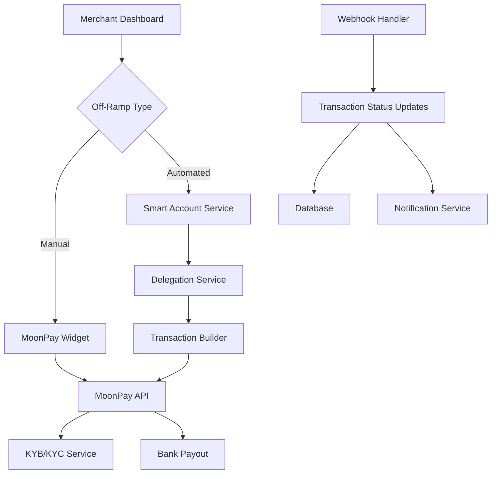

# Off-Ramp Implementation Plan - Part 4

## Executive Summary

This document outlines the implementation plan for integrating MoonPay's off-ramp solution into Cyphera, enabling merchants to convert their crypto revenue to fiat currency. The implementation will support two flows: a manual flow using MoonPay's widget for immediate merchant-initiated conversions, and an automated flow utilizing smart accounts and delegations for programmatic off-ramping.

## Business Requirements

### Core Objectives
1. **Manual Off-Ramp**: Allow merchants to manually convert crypto to fiat through an embedded widget
2. **Automated Off-Ramp**: Enable programmatic crypto-to-fiat conversion using smart accounts
3. **KYB/KYC Compliance**: Ensure proper business verification for merchant accounts
4. **Multi-Currency Support**: Support multiple cryptocurrencies and fiat payout options
5. **Security**: Implement signed URLs and secure transaction handling

### Use Cases
1. **Merchant Dashboard Off-Ramp**: One-click conversion of accumulated crypto revenue
2. **Scheduled Auto-Conversion**: Daily/weekly/monthly automatic conversions
3. **Threshold-Based Conversion**: Auto-convert when balance reaches specified amount
4. **Invoice Settlement**: Automatic conversion of received invoice payments

## Technical Architecture

### System Overview


### Component Architecture

#### 1. Frontend Components
```typescript
/apps/web-app/src/
├── components/
│   ├── offramp/
│   │   ├── OffRampWidget.tsx          # MoonPay widget wrapper
│   │   ├── OffRampSettings.tsx        # Auto-conversion settings
│   │   ├── OffRampHistory.tsx         # Transaction history
│   │   └── KYBStatus.tsx              # KYB verification status
│   ├── dashboard/
│   │   └── BalanceCard.tsx            # Enhanced with off-ramp button
├── hooks/
│   ├── offramp/
│   │   ├── use-moonpay.ts             # MoonPay SDK integration
│   │   ├── use-offramp-settings.ts    # Settings management
│   │   └── use-kyb-status.ts          # KYB status tracking
└── services/
    └── offramp/
        ├── moonpay-client.ts          # API client
        └── signature-service.ts       # URL signing

```

#### 2. Backend Components
```go
/apps/api/
├── handlers/
│   ├── offramp_handlers.go            # Off-ramp API endpoints
│   ├── kyb_handlers.go                # KYB management
│   └── webhook_handlers.go            # MoonPay webhooks
├── services/
│   ├── offramp/
│   │   ├── moonpay_service.go        # MoonPay integration
│   │   ├── signature_service.go      # URL signing
│   │   ├── automation_service.go     # Auto-conversion logic
│   │   └── kyb_service.go            # KYB verification
└── workers/
    └── offramp_worker.go              # Background processing
```

#### 3. Database Schema
```sql
-- Off-ramp settings table
CREATE TABLE offramp_settings (
    id UUID PRIMARY KEY DEFAULT gen_random_uuid(),
    workspace_id UUID NOT NULL REFERENCES workspaces(id),
    
    -- Manual settings
    enabled BOOLEAN DEFAULT true,
    default_fiat_currency VARCHAR(3) DEFAULT 'USD',
    default_payout_method VARCHAR(50), -- 'sepa_bank_account', 'ach_bank_account', etc.
    
    -- Automation settings
    auto_convert_enabled BOOLEAN DEFAULT false,
    auto_convert_schedule VARCHAR(20), -- 'daily', 'weekly', 'monthly'
    auto_convert_time TIME, -- Time of day for scheduled conversions
    auto_convert_threshold_enabled BOOLEAN DEFAULT false,
    auto_convert_threshold_amount BIGINT, -- In smallest unit (wei/satoshi)
    auto_convert_threshold_currency VARCHAR(10), -- ETH, BTC, etc.
    
    -- Conversion preferences
    min_conversion_amount BIGINT,
    max_conversion_amount BIGINT,
    target_currencies TEXT[], -- Array of crypto currencies to convert
    
    created_at TIMESTAMPTZ DEFAULT CURRENT_TIMESTAMP,
    updated_at TIMESTAMPTZ DEFAULT CURRENT_TIMESTAMP,
    
    CONSTRAINT fk_workspace FOREIGN KEY (workspace_id) REFERENCES workspaces(id) ON DELETE CASCADE
);

-- KYB verification status
CREATE TABLE kyb_verifications (
    id UUID PRIMARY KEY DEFAULT gen_random_uuid(),
    workspace_id UUID NOT NULL REFERENCES workspaces(id),
    moonpay_customer_id VARCHAR(255),
    
    -- Verification status
    status VARCHAR(50) NOT NULL, -- 'not_started', 'pending', 'approved', 'rejected'
    verification_level VARCHAR(50), -- 'basic', 'enhanced'
    
    -- Business information
    business_name VARCHAR(255),
    business_type VARCHAR(100),
    business_registration_number VARCHAR(100),
    business_country VARCHAR(2),
    
    -- Verification details
    submitted_at TIMESTAMPTZ,
    verified_at TIMESTAMPTZ,
    rejection_reason TEXT,
    required_documents TEXT[],
    
    created_at TIMESTAMPTZ DEFAULT CURRENT_TIMESTAMP,
    updated_at TIMESTAMPTZ DEFAULT CURRENT_TIMESTAMP,
    
    CONSTRAINT fk_workspace FOREIGN KEY (workspace_id) REFERENCES workspaces(id) ON DELETE CASCADE,
    UNIQUE(workspace_id)
);

-- Off-ramp transactions
CREATE TABLE offramp_transactions (
    id UUID PRIMARY KEY DEFAULT gen_random_uuid(),
    workspace_id UUID NOT NULL REFERENCES workspaces(id),
    moonpay_transaction_id VARCHAR(255) UNIQUE,
    
    -- Transaction details
    transaction_type VARCHAR(20) NOT NULL, -- 'manual', 'scheduled', 'threshold'
    status VARCHAR(50) NOT NULL, -- 'pending', 'waiting_deposit', 'processing', 'completed', 'failed'
    
    -- Amounts
    crypto_currency VARCHAR(10) NOT NULL,
    crypto_amount VARCHAR(255) NOT NULL, -- Store as string for precision
    fiat_currency VARCHAR(3) NOT NULL,
    fiat_amount BIGINT NOT NULL, -- In cents/smallest unit
    fee_amount BIGINT,
    net_amount BIGINT,
    
    -- Transaction flow
    deposit_address VARCHAR(255),
    transaction_hash VARCHAR(255),
    payout_method VARCHAR(50),
    payout_reference VARCHAR(255),
    
    -- Automation details
    automation_rule_id UUID,
    triggered_by VARCHAR(50), -- 'user', 'schedule', 'threshold'
    
    -- Timestamps
    initiated_at TIMESTAMPTZ DEFAULT CURRENT_TIMESTAMP,
    deposited_at TIMESTAMPTZ,
    completed_at TIMESTAMPTZ,
    failed_at TIMESTAMPTZ,
    failure_reason TEXT,
    
    -- Metadata
    metadata JSONB DEFAULT '{}',
    
    CONSTRAINT fk_workspace FOREIGN KEY (workspace_id) REFERENCES workspaces(id) ON DELETE CASCADE
);

-- Automation rules for tracking
CREATE TABLE offramp_automation_rules (
    id UUID PRIMARY KEY DEFAULT gen_random_uuid(),
    workspace_id UUID NOT NULL REFERENCES workspaces(id),
    
    rule_type VARCHAR(20) NOT NULL, -- 'schedule', 'threshold'
    is_active BOOLEAN DEFAULT true,
    
    -- Rule configuration (stored in settings, this is for execution tracking)
    last_executed_at TIMESTAMPTZ,
    next_execution_at TIMESTAMPTZ,
    execution_count INTEGER DEFAULT 0,
    
    created_at TIMESTAMPTZ DEFAULT CURRENT_TIMESTAMP,
    updated_at TIMESTAMPTZ DEFAULT CURRENT_TIMESTAMP,
    
    CONSTRAINT fk_workspace FOREIGN KEY (workspace_id) REFERENCES workspaces(id) ON DELETE CASCADE
);

CREATE INDEX idx_offramp_transactions_workspace ON offramp_transactions(workspace_id);
CREATE INDEX idx_offramp_transactions_status ON offramp_transactions(status);
CREATE INDEX idx_kyb_verifications_status ON kyb_verifications(workspace_id, status);
CREATE INDEX idx_automation_rules_next_execution ON offramp_automation_rules(next_execution_at) WHERE is_active = true;
```

## Implementation Details

### Phase 1: Manual Off-Ramp Flow

#### 1.1 MoonPay Widget Integration
```typescript
// components/offramp/OffRampWidget.tsx
import { MoonPaySellWidget } from '@moonpay/moonpay-react';
import { useMoonPaySignature } from '@/hooks/offramp/use-moonpay';

export function OffRampWidget({ 
  cryptoCurrency,
  amount,
  onComplete 
}: OffRampWidgetProps) {
  const { signUrl, isKYBVerified } = useMoonPaySignature();
  const [visible, setVisible] = useState(false);
  
  // Check KYB status before showing widget
  useEffect(() => {
    if (!isKYBVerified) {
      router.push('/settings/kyb-verification');
    }
  }, [isKYBVerified]);
  
  return (
    <>
      <Button onClick={() => setVisible(true)}>
        Convert to Fiat
      </Button>
      
      <MoonPaySellWidget
        visible={visible}
        variant="overlay"
        baseCurrencyCode={cryptoCurrency}
        baseCurrencyAmount={amount}
        email={merchant.email}
        externalCustomerId={workspace.id}
        onUrlSignatureRequested={signUrl}
        onTransactionCompleted={(data) => {
          onComplete(data);
          setVisible(false);
        }}
        onInitiateDeposit={async (data) => {
          // Handle deposit initiation
          await handleDeposit(data);
        }}
      />
    </>
  );
}
```

#### 1.2 URL Signing Service
```go
// services/offramp/signature_service.go
type SignatureService struct {
    secretKey string
}

func (s *SignatureService) SignURL(originalURL string) (string, error) {
    // Parse URL
    u, err := url.Parse(originalURL)
    if err != nil {
        return "", err
    }
    
    // Create HMAC signature
    h := hmac.New(sha256.New, []byte(s.secretKey))
    h.Write([]byte(u.RawQuery))
    signature := base64.URLEncoding.EncodeToString(h.Sum(nil))
    
    // Append signature to URL
    q := u.Query()
    q.Set("signature", signature)
    u.RawQuery = q.Encode()
    
    return u.String(), nil
}
```

### Phase 2: Automated Off-Ramp Flow

#### 2.1 Smart Account Integration
```typescript
// services/offramp/automated-offramp.ts
export class AutomatedOffRampService {
  async executeAutomatedConversion(params: {
    workspaceId: string;
    smartAccountAddress: Address;
    cryptoCurrency: string;
    amount: bigint;
    delegation: Delegation;
  }) {
    // 1. Verify smart account has sufficient balance
    const balance = await this.getBalance(
      params.smartAccountAddress,
      params.cryptoCurrency
    );
    
    if (balance < params.amount) {
      throw new Error('Insufficient balance');
    }
    
    // 2. Get MoonPay deposit address
    const depositAddress = await this.moonpayService.getDepositAddress({
      customerId: params.workspaceId,
      cryptoCurrency: params.cryptoCurrency,
      fiatCurrency: 'USD',
      amount: params.amount
    });
    
    // 3. Create UserOperation for transfer
    const userOp = await this.createTransferUserOp({
      from: params.smartAccountAddress,
      to: depositAddress,
      amount: params.amount,
      delegation: params.delegation
    });
    
    // 4. Submit to bundler
    const txHash = await this.bundlerClient.sendUserOperation(userOp);
    
    // 5. Track transaction
    await this.trackOffRampTransaction({
      workspaceId: params.workspaceId,
      moonpayTransactionId: depositAddress.transactionId,
      txHash,
      amount: params.amount,
      type: 'automated'
    });
    
    return txHash;
  }
}
```

#### 2.2 Automation Worker
```go
// workers/offramp_worker.go
type OffRampWorker struct {
    db              *sql.DB
    moonpayService  *moonpay.Service
    delegationSvc   *delegation.Service
    smartAccountSvc *smartaccount.Service
}

func (w *OffRampWorker) ProcessScheduledConversions() error {
    // Find all active scheduled rules due for execution
    rules, err := w.getActiveScheduledRules()
    if err != nil {
        return err
    }
    
    for _, rule := range rules {
        // Get workspace settings
        settings, err := w.getOffRampSettings(rule.WorkspaceID)
        if err != nil {
            continue
        }
        
        // Check if workspace has verified KYB
        if !w.isKYBVerified(rule.WorkspaceID) {
            log.Printf("Skipping workspace %s - KYB not verified", rule.WorkspaceID)
            continue
        }
        
        // Get smart account balance
        balance, err := w.getSmartAccountBalance(rule.WorkspaceID)
        if err != nil {
            continue
        }
        
        // Check if balance meets minimum threshold
        if balance.Cmp(settings.MinConversionAmount) < 0 {
            continue
        }
        
        // Execute automated conversion
        err = w.executeConversion(rule.WorkspaceID, balance, settings)
        if err != nil {
            log.Printf("Failed to execute conversion: %v", err)
            continue
        }
        
        // Update rule execution time
        w.updateRuleExecution(rule.ID)
    }
    
    return nil
}

func (w *OffRampWorker) executeConversion(
    workspaceID string,
    amount *big.Int,
    settings *OffRampSettings,
) error {
    // 1. Get workspace smart account and delegation
    smartAccount, delegation, err := w.smartAccountSvc.GetWorkspaceAccount(workspaceID)
    if err != nil {
        return err
    }
    
    // 2. Create off-ramp transaction via MoonPay
    transaction, err := w.moonpayService.CreateSellTransaction(&moonpay.SellParams{
        CustomerID:       workspaceID,
        CryptoCurrency:   settings.DefaultCrypto,
        CryptoAmount:     amount.String(),
        FiatCurrency:     settings.DefaultFiatCurrency,
        PayoutMethod:     settings.DefaultPayoutMethod,
    })
    if err != nil {
        return err
    }
    
    // 3. Execute transfer to MoonPay deposit address
    txHash, err := w.delegationSvc.ExecuteTransfer(&delegation.TransferParams{
        SmartAccount: smartAccount,
        Delegation:   delegation,
        To:           transaction.DepositAddress,
        Amount:       amount,
        TokenAddress: settings.TokenAddress,
    })
    if err != nil {
        return err
    }
    
    // 4. Record transaction
    err = w.recordOffRampTransaction(&OffRampTransaction{
        WorkspaceID:          workspaceID,
        MoonPayTransactionID: transaction.ID,
        TransactionType:      "scheduled",
        Status:              "waiting_deposit",
        CryptoAmount:        amount.String(),
        TransactionHash:     txHash,
    })
    
    return err
}
```

### Phase 3: KYB/KYC Integration

#### 3.1 KYB Flow
```typescript
// components/offramp/KYBVerification.tsx
export function KYBVerification() {
  const { workspace } = useWorkspace();
  const [status, setStatus] = useState<KYBStatus>('not_started');
  
  const initiateKYB = async () => {
    // Create MoonPay customer
    const customer = await moonpayAPI.createCustomer({
      email: workspace.email,
      externalCustomerId: workspace.id,
      businessName: workspace.name,
      businessType: workspace.businessType,
    });
    
    // Generate KYB widget URL
    const kybUrl = await moonpayAPI.getKYBWidgetUrl({
      customerId: customer.id,
      redirectUrl: `${window.location.origin}/settings/kyb-complete`,
    });
    
    // Open KYB flow
    window.open(kybUrl, '_blank');
  };
  
  return (
    <Card>
      <CardHeader>
        <CardTitle>Business Verification</CardTitle>
        <CardDescription>
          Complete business verification to enable fiat withdrawals
        </CardDescription>
      </CardHeader>
      <CardContent>
        <KYBStatusIndicator status={status} />
        {status === 'not_started' && (
          <Button onClick={initiateKYB}>
            Start Verification
          </Button>
        )}
      </CardContent>
    </Card>
  );
}
```

#### 3.2 KYB Webhook Handler
```go
// handlers/webhook_handlers.go
func (h *WebhookHandler) HandleMoonPayWebhook(c *gin.Context) {
    var event moonpay.WebhookEvent
    if err := c.ShouldBindJSON(&event); err != nil {
        c.JSON(400, gin.H{"error": "Invalid webhook payload"})
        return
    }
    
    // Verify webhook signature
    if !h.verifyWebhookSignature(c.Request, event) {
        c.JSON(401, gin.H{"error": "Invalid signature"})
        return
    }
    
    switch event.Type {
    case "customer_verification_completed":
        err := h.handleKYBComplete(event.Data)
    case "sell_transaction_completed":
        err := h.handleTransactionComplete(event.Data)
    case "sell_transaction_failed":
        err := h.handleTransactionFailed(event.Data)
    default:
        log.Printf("Unhandled webhook event: %s", event.Type)
    }
    
    c.JSON(200, gin.H{"success": true})
}
```

## Security Considerations

### 1. API Key Management
```yaml
# Environment variables
MOONPAY_API_KEY_TEST=pk_test_xxx
MOONPAY_SECRET_KEY_TEST=sk_test_xxx
MOONPAY_API_KEY_LIVE=pk_live_xxx
MOONPAY_SECRET_KEY_LIVE=sk_live_xxx
MOONPAY_WEBHOOK_SECRET=whsec_xxx
```

### 2. Signed URL Implementation
- All widget URLs must be signed server-side
- Include workspace ID and timestamp in signature
- Validate signature expiration (5 minutes)
- Never expose secret keys to frontend

### 3. Smart Account Security
- Validate delegations before executing transfers
- Implement transaction limits
- Monitor for suspicious activity
- Rate limit automated conversions

### 4. Data Protection
- Encrypt sensitive KYB data at rest
- Audit log all off-ramp transactions
- Implement PII data retention policies
- Secure webhook endpoints with signature verification

## Testing Strategy

### 1. Unit Tests
```typescript
describe('OffRampService', () => {
  it('should generate valid signed URLs', async () => {
    const url = await service.generateSignedUrl({
      baseCurrency: 'ETH',
      amount: '0.1',
      workspaceId: 'test-123'
    });
    
    expect(url).toContain('signature=');
    expect(await service.verifySignature(url)).toBe(true);
  });
  
  it('should handle automated conversion', async () => {
    const result = await service.executeAutomatedConversion({
      workspaceId: 'test-123',
      amount: parseEther('1'),
      cryptoCurrency: 'ETH'
    });
    
    expect(result.status).toBe('pending');
    expect(result.depositAddress).toBeDefined();
  });
});
```

### 2. Integration Tests
- Test MoonPay sandbox environment
- Verify webhook handling
- Test KYB flow completion
- Validate transaction status updates

### 3. E2E Tests
```typescript
describe('Off-Ramp Flow', () => {
  it('should complete manual off-ramp', async () => {
    // 1. Login as merchant
    await loginAsMerchant();
    
    // 2. Navigate to balance page
    await page.goto('/dashboard/balance');
    
    // 3. Click convert button
    await page.click('[data-testid="convert-to-fiat"]');
    
    // 4. Complete MoonPay flow
    await completeMoonPayFlow();
    
    // 5. Verify transaction recorded
    await expect(page).toHaveText('Conversion initiated');
  });
});
```

## Implementation Timeline

### Week 1: Foundation
- Days 1-2: Database schema and API setup
- Days 3-4: MoonPay SDK integration
- Days 5-6: Manual off-ramp UI components

### Week 2: Automation
- Days 7-8: Smart account integration
- Days 9-10: Automation worker and rules
- Days 11-12: KYB/KYC flow

### Week 3: Testing & Polish
- Days 13-14: Comprehensive testing
- Days 15-16: Security audit and fixes
- Days 17-18: Documentation and deployment

## Success Metrics

1. **Manual Conversions**: < 3 clicks to initiate
2. **Automated Success Rate**: > 95% successful executions
3. **KYB Completion**: > 80% of merchants verified
4. **Transaction Time**: < 5 minutes for deposit confirmation
5. **Cost Efficiency**: < 2% total fees (including gas)

## Monitoring & Alerts

### Key Metrics to Track
- Daily/weekly/monthly conversion volumes
- Average conversion amounts
- Failed transaction rates
- KYB verification funnel
- Automation rule execution success

### Alert Conditions
- Failed automated conversions
- KYB rejections
- Large conversion requests (> $10k)
- Repeated failed attempts
- Webhook delivery failures

## Future Enhancements

1. **Multi-Currency Payouts**: Support EUR, GBP, and other fiat currencies
2. **Advanced Rules**: Complex automation rules with multiple conditions
3. **Bulk Conversions**: Convert multiple tokens in single transaction
4. **Tax Reporting**: Automated tax document generation
5. **Treasury Management**: Advanced cash flow optimization tools