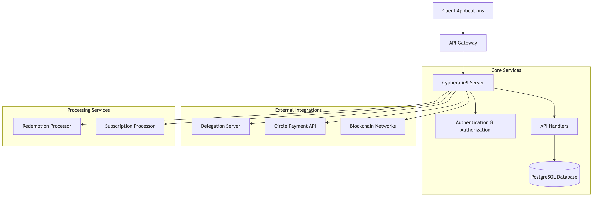
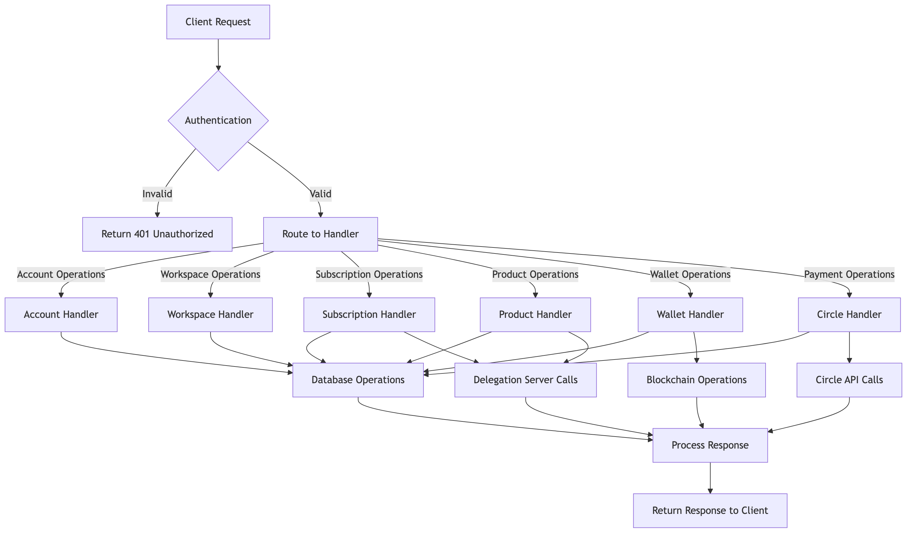
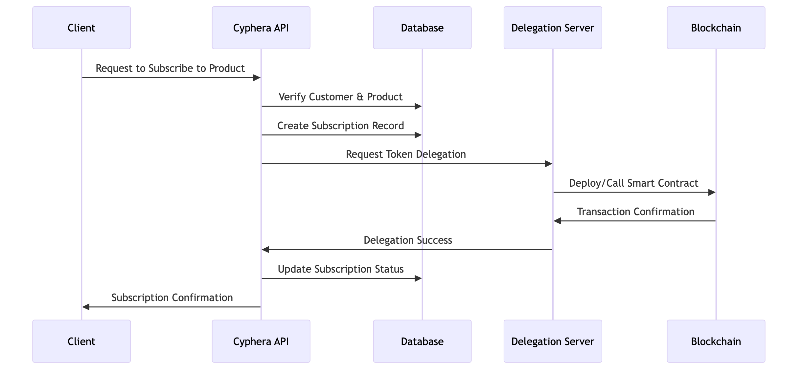
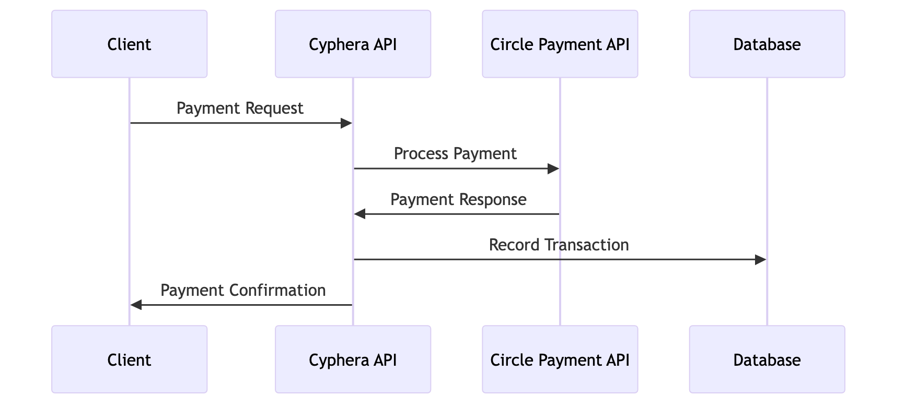
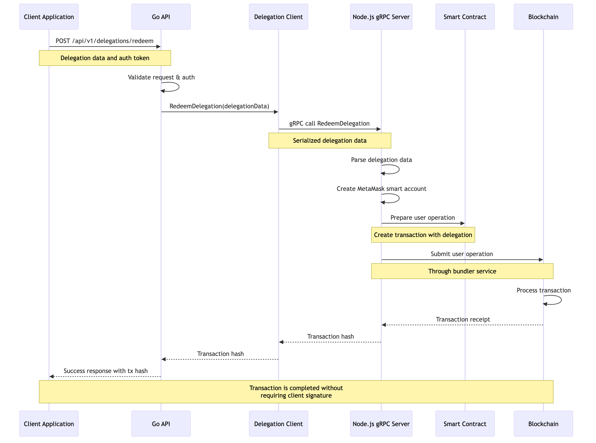

# Cyphera API: Backend Architecture Documentation

## Overview

The Cyphera API is a robust backend application built with Go, designed to manage blockchain-related operations, subscriptions, wallet management, and more. This document explains the architecture and flow of the application for non-technical stakeholders.

## Table of Contents

- [Architecture Overview](#architecture-diagram)
- [Component Flow](#component-flow-diagram)
- [Database Schema](#database-schema-overview)
- [Key Components](#key-components-explanation)
- [Request Flow](#request-flow-description)
- [Subscription Flow](#subscription-flow-example)
- [Payment Flow](#payment-processing-flow)
- [Delegation System](#delegation-system)
- [Deployment Architecture](#deployment-architecture)
- [Additional Documentation](#additional-documentation)

## Architecture Diagram

[View Mermaid source](architecture_diagram.mmd)

High-level overview of the system architecture showing the main components and their relationships.

## Component Flow Diagram

[View Mermaid source](component_flow_diagram.mmd)

Detailed flow of requests through the various components of the system.

## Database Schema Overview

[View Mermaid source](cyphera_erd_april_6th.mmd) | [View DBML schema](cyphera_db_schema_april_6th.dbml)

Complete ERD with all tables and relationships as of April 6th, 2024.

## Key Components Explanation

### 1. API Server

The API server is the main entry point for all client requests. It's built using the Gin web framework and can be deployed as an AWS Lambda function or as a standalone server.

**Key Functions:**
- Handles HTTP requests and responses
- Routes requests to appropriate handlers
- Manages authentication and authorization
- Processes API calls and returns responses

### 2. Authentication & Authorization

The authentication system verifies the identity of clients making requests to the API.

**Authentication Methods:**
- API Key authentication
- JWT token authentication

**Authorization Levels:**
- Admin access
- Regular user access
- API client access

### 3. Handlers

Handlers process specific types of requests and implement the business logic of the application.

**Main Handlers:**
- **Account Handler:** Manages user accounts and authentication
- **Workspace Handler:** Manages organizational workspaces
- **Customer Handler:** Manages customer information
- **Product Handler:** Manages product offerings and details
- **Subscription Handler:** Manages subscription creation and processing
- **Wallet Handler:** Manages blockchain wallets and transactions
- **Circle Handler:** Integrates with Circle's payment platform

### 4. Database Layer

A PostgreSQL database stores all application data with a well-structured schema.

**Key Data Entities:**
- Accounts and Users
- Workspaces
- Customers and Wallets
- Products and Tokens
- Subscriptions and Events
- Network configurations

### 5. Delegation Server

A separate service that handles blockchain delegation operations, built with Node.js.

**Responsibilities:**
- Processing blockchain transactions
- Managing smart contract interactions
- Handling delegation of subscription tokens

### 6. Processing Services

Background services that handle asynchronous tasks.

**Key Processors:**
- **Redemption Processor:** Processes token redemptions asynchronously
- **Subscription Processor:** Manages subscription lifecycle events

## Request Flow Description

1. **Client Request Initiation:**
   - A client application sends an HTTP request to the Cyphera API endpoint
   - The request includes authentication (API key or bearer token)

2. **Authentication & Routing:**
   - The API Gateway forwards the request to the Cyphera API server
   - The auth middleware verifies the authentication credentials
   - If valid, the request is routed to the appropriate handler

3. **Handler Processing:**
   - The handler processes the request according to business rules
   - It interacts with the database to read or write data
   - For blockchain operations, it communicates with the Delegation Server
   - For payment operations, it communicates with the Circle API

4. **Response Generation:**
   - The handler generates an appropriate response
   - Success or error information is formatted as JSON
   - The response is returned to the client

## Subscription Flow Example

[View Mermaid source](subscription_flow.mmd)

Sequence diagram showing the flow of a subscription creation process.

## Payment Processing Flow

[View Mermaid source](payment_flow.mmd)

Sequence diagram showing the flow of payment processing.

## Delegation System

The Delegation System enables users to authorize blockchain transactions in advance that can be executed later without requiring additional signatures. This is a critical component for subscription-based services.

### Delegation Redemption Process

[View Mermaid source](delegation_redemption_flow.mmd)

The diagram above illustrates the delegation redemption process flow.

### System Components

1. **Go API Integration**
   - Exposes HTTP endpoints for delegation redemption
   - Validates and forwards delegation data to the Node.js service
   - Manages authentication and authorization for redemption requests

2. **Delegation Client**
   - Provides a reusable client for the gRPC service
   - Handles connection management and error handling
   - Used by both the direct handler and the HTTP handlers

3. **Node.js gRPC Server**
   - Runs as a separate service (in the `delegation-server` directory)
   - Handles the actual delegation redemption process
   - Communicates with blockchain providers and bundlers
   - Uses MetaMask's delegation libraries for account creation and transaction submission

### Key Features

- **Delegated Transactions**: Users can authorize transactions that can be executed later
- **Smart Account Creation**: Creates MetaMask smart accounts using a configured private key
- **Gas Abstraction**: Handles gas fees and paymaster interactions
- **Security**: Uses proper authentication and encrypted communication

### Technical Details

- The delegation system uses a gRPC interface between the Go API and Node.js server
- The MetaMask delegation protocol allows for secure transaction authorization
- All blockchain operations are conducted through the Node.js server for consistency
- Transaction receipts and errors are properly propagated back to the client

For more detailed information, see the [Delegation System documentation](DELEGATION_SYSTEM.md).

## Deployment Architecture

The Cyphera API is designed to be deployed in cloud environments, with the following components:

- **API Server:** AWS Lambda or containerized deployment
- **Database:** PostgreSQL database (AWS RDS or similar)
- **Delegation Server:** Separate Node.js service
- **Background Processors:** Containerized services or serverless functions

## Additional Documentation

- [Delegation System](DELEGATION_SYSTEM.md) - Details on the delegation system architecture
- [API Reference (Swagger)](swagger.yaml) - Swagger API documentation

## Conclusion

The Cyphera API provides a comprehensive backend system for managing blockchain-related operations, subscriptions, and integrations with payment processors. Its modular architecture allows for scalability and maintainability, while the separation of concerns between different components ensures reliable operation.

The system is designed with security in mind, implementing proper authentication and authorization mechanisms at multiple levels. The use of modern technologies and best practices ensures a robust foundation for the application's business needs. 