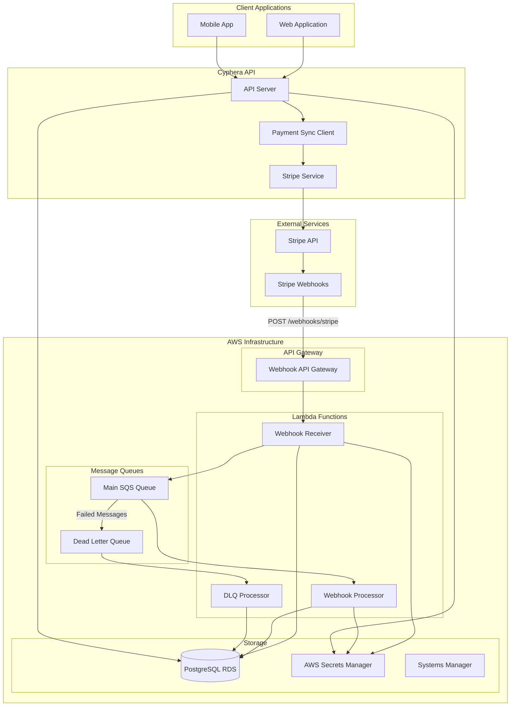
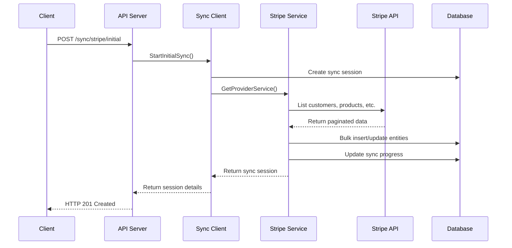
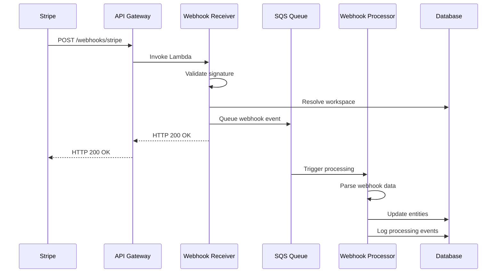

# Stripe 2-Way Payment Sync - Complete Implementation Guide

**Version:** 2.0  
**Date:** December 2024  
**Status:** Production Ready

## Table of Contents

1. [Overview](#overview)
2. [Why We Built This](#why-we-built-this)
3. [Architecture Overview](#architecture-overview)
4. [Components Breakdown](#components-breakdown)
5. [How It Works](#how-it-works)
6. [Database Schema](#database-schema)
7. [API Endpoints](#api-endpoints)
8. [Webhook Processing](#webhook-processing)
9. [Deployment & Setup](#deployment--setup)
10. [Code Examples](#code-examples)
11. [Testing](#testing)
12. [Monitoring & Troubleshooting](#monitoring--troubleshooting)
13. [Security Considerations](#security-considerations)

## Overview

The Stripe 2-Way Payment Sync system is a comprehensive, multi-tenant solution that maintains bidirectional synchronization between Cyphera's workspace-based architecture and Stripe's payment infrastructure. It enables real-time data consistency across multiple workspaces, each with their own Stripe accounts, while providing robust webhook processing and initial data synchronization capabilities.

### Key Features

- **Multi-Tenant Architecture**: Each workspace has isolated Stripe configurations
- **Real-Time Synchronization**: Webhooks ensure immediate data updates
- **Initial Data Import**: Bulk synchronization for existing Stripe accounts
- **Workspace Isolation**: Complete data separation between workspaces
- **Scalable Processing**: AWS Lambda-based webhook processing
- **Comprehensive Coverage**: Syncs customers, products, prices, subscriptions, and invoices

## Why We Built This

### Business Requirements

1. **Multi-Workspace Support**: Cyphera serves multiple merchants, each with their own Stripe account
2. **Real-Time Updates**: Changes in Stripe must immediately reflect in Cyphera
3. **Data Consistency**: Ensure product, pricing, and subscription data stays synchronized
4. **Subscription Management**: Link Stripe subscriptions to Cyphera's token-based rewards system
5. **Scalability**: Handle hundreds of workspaces with concurrent webhook processing

### Technical Challenges Solved

- **Workspace Routing**: Determining which workspace a webhook belongs to
- **Concurrent Processing**: Multiple workspaces receiving webhooks simultaneously
- **Data Integrity**: Preventing cross-workspace data contamination
- **Error Recovery**: Robust retry mechanisms and dead letter queue processing
- **Configuration Management**: Secure storage and retrieval of workspace-specific Stripe credentials

## Architecture Overview



### Data Flow Diagrams

#### Initial Sync Flow


#### Webhook Processing Flow


## Components Breakdown

### 1. Payment Sync Client (`internal/client/payment_sync/client.go`)

The central orchestrator that manages workspace-specific payment provider configurations.

**Key Responsibilities:**
- Workspace configuration management
- Credential encryption/decryption
- Provider service factory
- Sync session management

```go
type PaymentSyncClient struct {
    db            *db.Queries
    logger        *zap.Logger
    encryptionKey []byte
    providers     map[string]PaymentSyncService
}

func (c *PaymentSyncClient) GetProviderService(ctx context.Context, workspaceID, providerName string) (PaymentSyncService, error)
```

### 2. Stripe Service (`internal/client/payment_sync/stripe/stripe.go`)

Implements the PaymentSyncService interface for Stripe-specific operations.

**Key Responsibilities:**
- Stripe API communication
- Initial data synchronization
- Webhook validation and processing
- Entity mapping (Stripe ↔ Cyphera)

### 3. Webhook Lambda Functions

#### Webhook Receiver (`cmd/webhook-receiver/main.go`)
- Receives webhooks from API Gateway
- Validates Stripe signatures
- Resolves workspace from webhook data
- Queues events for processing

#### Webhook Processor (`cmd/webhook-processor/main.go`)
- Processes queued webhook events
- Updates database entities
- Handles different event types (customer, product, subscription, etc.)
- Implements retry logic

#### DLQ Processor (`cmd/dlq-processor/main.go`)
- Processes failed webhook events
- Implements exponential backoff
- Provides manual replay capabilities

### 4. Database Schema

The system uses PostgreSQL with comprehensive tables for multi-tenant payment sync:

**Core Tables:**
- `workspaces` - Tenant isolation
- `workspace_payment_configurations` - Encrypted Stripe credentials per workspace
- `workspace_provider_accounts` - Maps Stripe account IDs to workspaces
- `payment_sync_sessions` - Tracks sync operations
- `payment_sync_events` - Detailed event logging

**Entity Tables with Sync Support:**
- `customers` - Customer data with sync status
- `products` - Product catalog with sync tracking
- `prices` - Pricing information
- `subscriptions` - Subscription data
- `invoices` - Invoice management

Each entity table includes payment sync columns:
```sql
payment_sync_status VARCHAR(20) DEFAULT 'pending',
payment_synced_at TIMESTAMP WITH TIME ZONE,
payment_sync_version INTEGER DEFAULT 1,
payment_provider VARCHAR(50)
```

## How It Works

### Direction 1: Initial Sync (Cyphera ← Stripe)

When a workspace connects their Stripe account, we perform a complete initial synchronization:

1. **Configuration Setup**
   ```bash
   POST /api/v1/sync/config
   {
     "provider_name": "stripe",
     "configuration": {
       "api_key": "sk_live_...",
       "webhook_secret": "whsec_...",
       "environment": "live"
     }
   }
   ```

2. **Initial Sync Trigger**
   ```bash
   POST /api/v1/sync/stripe/initial
   {
     "entity_types": ["customers", "products", "prices", "subscriptions"],
     "batch_size": 100,
     "full_sync": true
   }
   ```

3. **Processing Steps**
   - Create sync session in database
   - Paginate through Stripe API endpoints
   - Transform Stripe entities to Cyphera format
   - Bulk insert/update database records
   - Track progress and handle errors

### Direction 2: Real-Time Updates (Cyphera ← Stripe via Webhooks)

Stripe sends webhooks for real-time updates:

1. **Webhook Reception**
   - Stripe sends POST to `https://api.cyphera.com/webhooks/stripe`
   - API Gateway routes to Webhook Receiver Lambda
   - Signature validation using workspace-specific webhook secrets

2. **Workspace Resolution**
   ```go
   func (app *Application) resolveWorkspaceFromStripeWebhook(ctx context.Context, body []byte, signature string) (string, error) {
       // Parse Stripe event
       event, err := webhook.ConstructEvent(body, signature, "")
       
       // Extract account ID from event
       accountID := event.Account
       
       // Query database for workspace
       return app.dbQueries.GetWorkspaceByProviderAccount(ctx, db.GetWorkspaceByProviderAccountParams{
           ProviderName:      "stripe",
           ProviderAccountID: accountID,
           Environment:       "live",
       })
   }
   ```

3. **Event Processing**
   - Queue event in SQS for async processing
   - Webhook Processor Lambda handles different event types
   - Update corresponding database entities
   - Log processing events for auditing

### Supported Event Types

| Stripe Event | Cyphera Action |
|--------------|----------------|
| `customer.created` | Create customer record |
| `customer.updated` | Update customer record |
| `customer.deleted` | Soft delete customer |
| `product.created` | Create product record |
| `product.updated` | Update product record |
| `price.created` | Create price record |
| `price.updated` | Update price record |
| `customer.subscription.created` | Create subscription |
| `customer.subscription.updated` | Update subscription |
| `customer.subscription.deleted` | Cancel subscription |
| `invoice.payment_succeeded` | Mark invoice as paid |
| `invoice.payment_failed` | Mark invoice as failed |

## Database Schema

### Workspace Configuration Tables

```sql
-- Multi-tenant payment provider configurations
CREATE TABLE workspace_payment_configurations (
    id UUID DEFAULT uuid_generate_v4() PRIMARY KEY,
    workspace_id UUID NOT NULL REFERENCES workspaces(id) ON DELETE CASCADE,
    provider_name VARCHAR(50) NOT NULL,
    is_active BOOLEAN NOT NULL DEFAULT true,
    is_test_mode BOOLEAN NOT NULL DEFAULT true,
    configuration JSONB NOT NULL DEFAULT '{}', -- Encrypted API keys
    webhook_endpoint_url TEXT,
    webhook_secret_key TEXT, -- Encrypted webhook secret
    connected_account_id TEXT, -- Stripe account ID
    last_sync_at TIMESTAMP WITH TIME ZONE,
    last_webhook_at TIMESTAMP WITH TIME ZONE,
    metadata JSONB DEFAULT '{}',
    created_at TIMESTAMP WITH TIME ZONE NOT NULL DEFAULT CURRENT_TIMESTAMP,
    updated_at TIMESTAMP WITH TIME ZONE NOT NULL DEFAULT CURRENT_TIMESTAMP,
    deleted_at TIMESTAMP WITH TIME ZONE,
    
    UNIQUE(workspace_id, provider_name, is_active)
);

-- Maps Stripe account IDs to workspaces for webhook routing
CREATE TABLE workspace_provider_accounts (
    id UUID DEFAULT uuid_generate_v4() PRIMARY KEY,
    workspace_id UUID NOT NULL REFERENCES workspaces(id) ON DELETE CASCADE,
    provider_name VARCHAR(50) NOT NULL,
    provider_account_id VARCHAR(255) NOT NULL, -- Stripe acct_xxx
    account_type VARCHAR(50) NOT NULL,
    is_active BOOLEAN NOT NULL DEFAULT true,
    environment VARCHAR(20) NOT NULL DEFAULT 'live',
    display_name VARCHAR(255),
    metadata JSONB DEFAULT '{}',
    created_at TIMESTAMP WITH TIME ZONE DEFAULT CURRENT_TIMESTAMP,
    updated_at TIMESTAMP WITH TIME ZONE DEFAULT CURRENT_TIMESTAMP,
    deleted_at TIMESTAMP WITH TIME ZONE,
    
    UNIQUE(provider_name, provider_account_id, environment)
);
```

### Sync Tracking Tables

```sql
-- Tracks sync operations
CREATE TABLE payment_sync_sessions (
    id UUID DEFAULT uuid_generate_v4() PRIMARY KEY,
    workspace_id UUID NOT NULL REFERENCES workspaces(id),
    provider_name VARCHAR(50) NOT NULL,
    session_type VARCHAR(50) NOT NULL, -- 'initial_sync', 'incremental_sync'
    status VARCHAR(20) NOT NULL DEFAULT 'pending',
    entity_types TEXT[] NOT NULL,
    config JSONB DEFAULT '{}',
    progress JSONB DEFAULT '{}',
    error_summary JSONB,
    started_at TIMESTAMP WITH TIME ZONE,
    completed_at TIMESTAMP WITH TIME ZONE,
    created_at TIMESTAMP WITH TIME ZONE DEFAULT CURRENT_TIMESTAMP,
    updated_at TIMESTAMP WITH TIME ZONE DEFAULT CURRENT_TIMESTAMP,
    deleted_at TIMESTAMP WITH TIME ZONE
);

-- Detailed event logging
CREATE TABLE payment_sync_events (
    id UUID DEFAULT uuid_generate_v4() PRIMARY KEY,
    session_id UUID REFERENCES payment_sync_sessions(id) ON DELETE CASCADE,
    workspace_id UUID NOT NULL REFERENCES workspaces(id),
    provider_name VARCHAR(50) NOT NULL,
    entity_type VARCHAR(50) NOT NULL,
    entity_id UUID,
    external_id VARCHAR(255), -- Stripe ID
    event_type VARCHAR(50) NOT NULL,
    event_message TEXT,
    event_details JSONB,
    webhook_event_id VARCHAR(255), -- Stripe evt_xxx
    provider_account_id VARCHAR(255), -- Stripe acct_xxx
    idempotency_key VARCHAR(255),
    processing_attempts INTEGER DEFAULT 0,
    signature_valid BOOLEAN,
    occurred_at TIMESTAMP WITH TIME ZONE DEFAULT CURRENT_TIMESTAMP
);
```

## API Endpoints

### Configuration Management

```bash
# Create payment provider configuration
POST /api/v1/sync/config
{
  "provider_name": "stripe",
  "is_active": true,
  "is_test_mode": false,
  "configuration": {
    "api_key": "sk_live_...",
    "webhook_secret": "whsec_...",
    "environment": "live"
  },
  "connected_account_id": "acct_1234567890"
}

# List configurations for workspace
GET /api/v1/sync/config

# Get specific configuration
GET /api/v1/sync/config/stripe

# Update configuration
PUT /api/v1/sync/config/{config_id}

# Delete configuration
DELETE /api/v1/sync/config/{config_id}

# Test connection
POST /api/v1/sync/config/{config_id}/test
```

### Sync Operations

```bash
# Start initial sync
POST /api/v1/sync/stripe/initial
{
  "entity_types": ["customers", "products", "prices", "subscriptions"],
  "batch_size": 100,
  "full_sync": true
}

# List sync sessions
GET /api/v1/sync/sessions?provider=stripe&status=completed

# Get sync session details
GET /api/v1/sync/sessions/{session_id}

# Get sync session status
GET /api/v1/sync/sessions/{session_id}/status
```

### Provider Account Management

```bash
# Create provider account mapping
POST /api/v1/sync/accounts
{
  "provider_name": "stripe",
  "provider_account_id": "acct_1234567890",
  "account_type": "standard",
  "environment": "live",
  "display_name": "Main Stripe Account"
}

# List provider accounts
GET /api/v1/sync/accounts
```

## Webhook Processing

### Webhook Endpoint Structure

```
POST https://api.cyphera.com/webhooks/stripe
```

### Webhook Receiver Implementation

```go
func (app *Application) HandleAPIGatewayRequest(ctx context.Context, request events.APIGatewayProxyRequest) (events.APIGatewayProxyResponse, error) {
    // Validate request
    body := request.Body
    signature := request.Headers["Stripe-Signature"]
    
    // Resolve workspace from webhook
    workspaceID, err := app.resolveWorkspaceFromWebhook(ctx, "stripe", []byte(body), signature)
    if err != nil {
        return events.APIGatewayProxyResponse{
            StatusCode: 400,
            Body:       `{"error": "workspace resolution failed"}`,
        }, nil
    }
    
    // Get workspace-specific configuration
    service, err := app.paymentSyncClient.GetProviderService(ctx, workspaceID, "stripe")
    if err != nil {
        return events.APIGatewayProxyResponse{
            StatusCode: 400,
            Body:       `{"error": "service configuration failed"}`,
        }, nil
    }
    
    // Validate webhook signature
    webhookEvent, err := service.HandleWebhook(ctx, []byte(body), signature)
    if err != nil {
        return events.APIGatewayProxyResponse{
            StatusCode: 400,
            Body:       `{"error": "webhook validation failed"}`,
        }, nil
    }
    
    // Queue for processing
    err = app.queueWebhookEvent(ctx, webhookEvent, workspaceID)
    if err != nil {
        return events.APIGatewayProxyResponse{
            StatusCode: 500,
            Body:       `{"error": "failed to queue event"}`,
        }, nil
    }
    
    return events.APIGatewayProxyResponse{
        StatusCode: 200,
        Body:       `{"received": true}`,
    }, nil
}
```

### Event Processing Logic

```go
func (app *Application) processStripeWebhookEvent(ctx context.Context, workspaceID string, webhookEvent payment_sync.WebhookEvent) error {
    eventType := webhookEvent.EventType
    
    switch {
    case strings.HasPrefix(eventType, "customer."):
        return app.processCustomerEvent(ctx, workspaceID, webhookEvent)
    case strings.HasPrefix(eventType, "product."):
        return app.processProductEvent(ctx, workspaceID, webhookEvent)
    case strings.HasPrefix(eventType, "price."):
        return app.processPriceEvent(ctx, workspaceID, webhookEvent)
    case strings.HasPrefix(eventType, "customer.subscription."):
        return app.processSubscriptionEvent(ctx, workspaceID, webhookEvent)
    case strings.HasPrefix(eventType, "invoice."):
        return app.processInvoiceEvent(ctx, workspaceID, webhookEvent)
    default:
        app.logger.Info("Unhandled webhook event type", 
            zap.String("event_type", eventType),
            zap.String("workspace_id", workspaceID))
        return nil
    }
}
```

## Deployment & Setup

### Prerequisites

1. **AWS Infrastructure** (managed by Terraform):
   - RDS PostgreSQL database
   - SQS queues (main + DLQ)
   - Secrets Manager for credentials
   - IAM roles and policies
   - VPC and security groups

2. **GitHub Secrets Configuration**:
   ```
   # Repository Secrets
   AWS_ACCESS_KEY_ID
   AWS_SECRET_ACCESS_KEY
   AWS_ACCOUNT_ID
   
   # Environment Secrets (dev/prod)
   SAM_DEPLOYMENT_BUCKET
   LAMBDA_SG_ID
   PRIVATE_SUBNET_1_ID
   PRIVATE_SUBNET_2_ID
   PAYMENT_SYNC_ENCRYPTION_KEY
   ```

### Deployment Process

The system uses AWS SAM for Lambda deployment with a custom deployment script:

```bash
# Deploy Terraform infrastructure first
cd terraform
terraform apply -target=aws_ssm_parameter.webhook_sqs_queue_url \
                -target=aws_ssm_parameter.webhook_dlq_queue_url \
                -target=aws_ssm_parameter.payment_sync_encryption_key_arn

# Deploy Lambda functions via GitHub Actions
git push origin main  # Triggers deployment workflow
```

### GitHub Actions Workflow

The deployment uses a 5-phase process:

1. **Validate**: SAM template and Go code validation
2. **Test**: Run webhook component tests (PR only)
3. **Build**: SAM build with container support
4. **Deploy**: Full SAM stack deployment
5. **Health Check**: Lambda function verification

### Manual Deployment Script

```bash
#!/bin/bash
# scripts/deploy_webhook_lambdas.sh

# Environment validation
: "${STAGE:?Environment variable STAGE is required}"
: "${AWS_REGION:?Environment variable AWS_REGION is required}"
: "${SAM_DEPLOYMENT_BUCKET:?Environment variable SAM_DEPLOYMENT_BUCKET is required}"

# Fetch Terraform outputs from SSM
echo "🔍 Fetching infrastructure parameters from SSM..."
RDS_SECRET_ARN=$(aws ssm get-parameter --name "/cyphera/rds-secret-arn-${STAGE}" --query "Parameter.Value" --output text)
RDS_ENDPOINT=$(aws ssm get-parameter --name "/cyphera/rds-endpoint-${STAGE}" --query "Parameter.Value" --output text)
WEBHOOK_SQS_QUEUE_URL=$(aws ssm get-parameter --name "/cyphera/webhook-sqs-queue-url-${STAGE}" --query "Parameter.Value" --output text)
WEBHOOK_DLQ_QUEUE_URL=$(aws ssm get-parameter --name "/cyphera/webhook-dlq-queue-url-${STAGE}" --query "Parameter.Value" --output text)

# SAM deployment
echo "🚀 Deploying webhook SAM infrastructure..."
sam deploy \
  --template-file deployment/template-webhook.yaml \
  --stack-name "cyphera-webhook-${STAGE}" \
  --s3-bucket "${SAM_DEPLOYMENT_BUCKET}" \
  --s3-prefix "webhook-${STAGE}" \
  --capabilities CAPABILITY_IAM \
  --parameter-overrides \
    "Stage=${STAGE}" \
    "RdsSecretArnValue=${RDS_SECRET_ARN}" \
    "DbHostValue=${RDS_ENDPOINT}" \
    "WebhookSqsQueueUrl=${WEBHOOK_SQS_QUEUE_URL}" \
    "WebhookDlqQueueUrl=${WEBHOOK_DLQ_QUEUE_URL}" \
    "LambdaSecurityGroupId=${LAMBDA_SG_ID}" \
    "PrivateSubnet1Id=${PRIVATE_SUBNET_1_ID}" \
    "PrivateSubnet2Id=${PRIVATE_SUBNET_2_ID}"
```

## Code Examples

### Workspace Configuration

```go
// Create Stripe configuration for a workspace
func setupStripeForWorkspace(client *payment_sync.PaymentSyncClient, workspaceID string) error {
    config := payment_sync.WorkspacePaymentConfig{
        WorkspaceID:  workspaceID,
        ProviderName: "stripe",
        IsActive:     true,
        IsTestMode:   false,
        Configuration: payment_sync.PaymentProviderConfig{
            APIKey:        "sk_live_...",
            WebhookSecret: "whsec_...",
            Environment:   "live",
        },
        ConnectedAccountID: "acct_1234567890",
        WebhookEndpointURL: "https://api.cyphera.com/webhooks/stripe",
    }
    
    _, err := client.CreateConfiguration(context.Background(), config)
    return err
}
```

### Initial Sync Execution

```go
// Start initial sync for all entity types
func startInitialSync(client *payment_sync.PaymentSyncClient, workspaceID string) error {
    config := payment_sync.InitialSyncConfig{
        EntityTypes: []string{"customers", "products", "prices", "subscriptions"},
        BatchSize:   100,
        FullSync:    true,
        MaxRetries:  3,
        RetryDelay:  2,
    }
    
    session, err := client.StartInitialSync(context.Background(), workspaceID, "stripe", config)
    if err != nil {
        return err
    }
    
    fmt.Printf("Started sync session: %s\n", session.ID)
    return nil
}
```

### Webhook Event Processing

```go
// Process customer.updated webhook
func processCustomerUpdated(ctx context.Context, db *db.Queries, workspaceID string, eventData map[string]interface{}) error {
    // Extract customer data from Stripe event
    customerData, ok := eventData["data"].(map[string]interface{})["object"].(map[string]interface{})
    if !ok {
        return fmt.Errorf("invalid customer data structure")
    }
    
    stripeCustomerID := customerData["id"].(string)
    email := customerData["email"].(string)
    name := customerData["name"].(string)
    
    // Update customer in database
    wsID := uuid.MustParse(workspaceID)
    
    customer, err := db.GetCustomerByExternalID(ctx, db.GetCustomerByExternalIDParams{
        WorkspaceID: wsID,
        ExternalID:  stripeCustomerID,
    })
    if err != nil {
        return fmt.Errorf("customer not found: %w", err)
    }
    
    // Update customer fields
    _, err = db.UpdateCustomer(ctx, db.UpdateCustomerParams{
        ID:     customer.ID,
        Email:  email,
        Name:   name,
    })
    
    return err
}
```

## Testing

### Unit Testing

```go
// Test webhook signature validation
func TestWebhookSignatureValidation(t *testing.T) {
    service := stripe.NewStripeService(logger, dbQueries)
    
    config := map[string]string{
        "api_key":        "sk_test_...",
        "webhook_secret": "whsec_test_...",
    }
    
    err := service.Configure(context.Background(), config)
    require.NoError(t, err)
    
    // Test valid signature
    body := []byte(`{"id": "evt_test", "type": "customer.created"}`)
    signature := generateTestSignature(body, "whsec_test_...")
    
    event, err := service.HandleWebhook(context.Background(), body, signature)
    assert.NoError(t, err)
    assert.Equal(t, "customer.created", event.EventType)
}
```

### Integration Testing

```go
// Test end-to-end webhook processing
func TestWebhookEndToEnd(t *testing.T) {
    // Setup test workspace
    workspaceID := createTestWorkspace(t)
    setupTestStripeConfig(t, workspaceID)
    
    // Send test webhook
    webhookPayload := createTestCustomerWebhook()
    response := sendWebhookRequest(t, webhookPayload)
    
    assert.Equal(t, 200, response.StatusCode)
    
    // Verify database update
    customer := getCustomerFromDB(t, workspaceID, "cus_test123")
    assert.Equal(t, "test@example.com", customer.Email)
}
```

### Load Testing

```bash
# Test webhook processing under load
hey -n 1000 -c 10 -m POST \
  -H "Stripe-Signature: t=..." \
  -d @webhook_payload.json \
  https://api.cyphera.com/webhooks/stripe
```

## Monitoring & Troubleshooting

### CloudWatch Metrics

Key metrics to monitor:

- **Lambda Duration**: Processing time for webhook functions
- **Lambda Errors**: Failed invocations and error rates
- **SQS Queue Depth**: Number of pending messages
- **DLQ Message Count**: Failed webhook events requiring attention

### Dashboard Queries

```sql
-- Get webhook processing statistics
SELECT 
    provider_name,
    COUNT(*) as total_webhook_events,
    COUNT(CASE WHEN event_type = 'webhook_processed_successfully' THEN 1 END) as successful_count,
    COUNT(CASE WHEN event_type = 'webhook_processing_failed' THEN 1 END) as failed_count,
    MAX(occurred_at) as last_webhook_at
FROM payment_sync_events 
WHERE workspace_id = $1 
  AND provider_name = 'stripe'
  AND webhook_event_id IS NOT NULL
GROUP BY provider_name;

-- Get sync session status
SELECT 
    provider_name,
    COUNT(*) as total_sessions,
    COUNT(CASE WHEN status = 'completed' THEN 1 END) as completed_sessions,
    COUNT(CASE WHEN status = 'failed' THEN 1 END) as failed_sessions,
    MAX(completed_at) as last_successful_sync
FROM payment_sync_sessions
WHERE workspace_id = $1
GROUP BY provider_name;
```

### Common Issues & Solutions

#### 1. Webhook Signature Validation Failures

**Symptoms**: HTTP 400 responses from webhook receiver

**Causes**:
- Incorrect webhook secret configuration
- Clock skew between Stripe and AWS
- Invalid signature header format

**Solutions**:
```go
// Debug signature validation
func debugWebhookSignature(body []byte, signature, secret string) {
    fmt.Printf("Body length: %d\n", len(body))
    fmt.Printf("Signature: %s\n", signature)
    fmt.Printf("Secret: %s\n", secret[:10]+"...")
    
    // Manually validate
    event, err := webhook.ConstructEvent(body, signature, secret)
    if err != nil {
        fmt.Printf("Validation error: %v\n", err)
    }
}
```

#### 2. Workspace Resolution Failures

**Symptoms**: Unable to determine which workspace a webhook belongs to

**Causes**:
- Missing provider account mapping
- Incorrect Stripe account ID in webhook
- Database connectivity issues

**Solutions**:
- Verify `workspace_provider_accounts` table has correct mappings
- Check webhook event structure for `account` field
- Ensure database connectivity from Lambda functions

#### 3. High DLQ Message Count

**Symptoms**: Messages accumulating in dead letter queue

**Causes**:
- Transient database errors
- Invalid webhook data format
- Processing logic bugs

**Solutions**:
- Review DLQ processor logs
- Implement manual replay functionality
- Add additional error handling

### Debugging Tools

```go
// Webhook event replayer for failed events
func replayWebhookEvent(ctx context.Context, db *db.Queries, eventID string) error {
    event, err := db.GetWebhookEventForReplay(ctx, db.GetWebhookEventForReplayParams{
        WorkspaceID:    uuid.MustParse(workspaceID),
        ProviderName:   "stripe",
        WebhookEventID: pgtype.Text{String: eventID, Valid: true},
    })
    if err != nil {
        return err
    }
    
    // Replay the event
    return processWebhookEvent(ctx, event)
}
```

## Security Considerations

### Data Encryption

1. **At Rest**: All Stripe API keys and webhook secrets encrypted using AES-256
2. **In Transit**: HTTPS for all API communications
3. **Key Management**: AWS Secrets Manager for encryption keys

### Access Control

1. **Workspace Isolation**: Strict database-level filtering by workspace_id
2. **IAM Roles**: Least-privilege access for Lambda functions
3. **VPC Security**: Lambda functions in private subnets

### Webhook Security

1. **Signature Verification**: All webhooks validated using Stripe signatures
2. **HTTPS Only**: Webhook endpoints require TLS
3. **Idempotency**: Duplicate webhook detection and handling

### Configuration Security

```go
// Secure configuration storage
func (c *PaymentSyncClient) encryptConfiguration(config PaymentProviderConfig) ([]byte, error) {
    plaintext, _ := json.Marshal(config)
    
    block, _ := aes.NewCipher(c.encryptionKey)
    gcm, _ := cipher.NewGCM(block)
    
    nonce := make([]byte, gcm.NonceSize())
    io.ReadFull(rand.Reader, nonce)
    
    ciphertext := gcm.Seal(nonce, nonce, plaintext, nil)
    return ciphertext, nil
}
```

---

## Conclusion

The Stripe 2-Way Payment Sync system provides a robust, scalable solution for maintaining data consistency between Cyphera's multi-tenant architecture and Stripe's payment infrastructure. With comprehensive webhook processing, secure credential management, and detailed monitoring capabilities, it enables seamless payment operations across hundreds of workspaces while maintaining strict data isolation and security standards.

For additional support or questions, refer to the codebase documentation or contact the development team. 